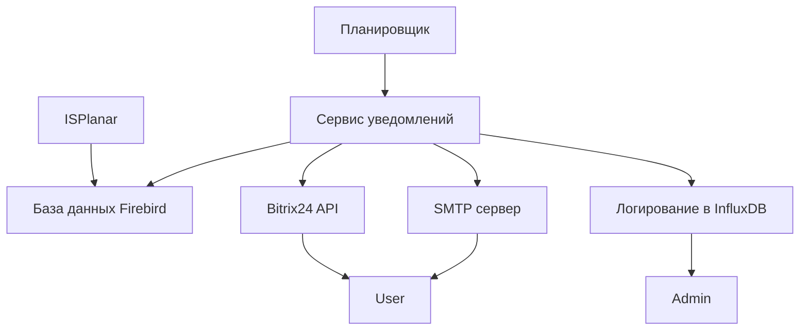

# Архитектура проекта

## Компоненты

1. **Сервис уведомлений (INS)**

   - Описание: Сервис автоматической рассылки уведомлений пользователям ISPlanar через различные каналы связи (Bitrix24, Email). Получает список уведомлений напрямую из базы данных Firebird и поддерживает централизованное логирование в InfluxDB.
   - Технологии: TypeScript + Node.js.
   - Зависимости:
     - Библиотеки: `axios`, `node-firebird`, `@influxdata/influxdb-client`, `dotenv`.
     - Инструменты разработки: `eslint`, `prettier`, `jest`, `ts-node`, `nodemon`.

2. **База данных Firebird**

   - Описание: Хранит данные о неподтвержденных уведомлениях, которые необходимо обработать. Также используется для хранения других данных системы ISPlanar.
   - Версия: Firebird 2.5.9.
   - Драйвер: `node-firebird`.

3. **Централизованное логирование (Log)**

   - Описание: Система сбора и хранения логов для мониторинга работы сервиса.
   - Технологии: InfluxDB.
   - Клиентская библиотека: `@influxdata/influxdb-client`.

4. **Каналы отправки уведомлений**
   - **Bitrix24**: Первичный канал отправки уведомлений через API Bitrix24.
     - Библиотека: `axios`.
   - **SMTP**: Резервный канал отправки уведомлений через почтовый сервер.
     - Примечание: Отправка через SMTP не реализована.

---

## Диаграмма компонентов



---

## Диаграмма последовательностей

```mermaid
sequenceDiagram
    participant Scheduler as Планировщик
    participant INS as Сервис уведомлений
    participant Firebird as База данных Firebird
    participant Bitrix as Bitrix24 API
    participant SMTP as SMTP сервер
    participant Log as Логирование

    loop Каждые 1-60 секунд
        Scheduler->>INS: Триггер обработки
        INS->>Firebird: Запрос на список уведомлений

        alt Есть уведомления
            Firebird-->>INS: Список уведомлений

            loop Для каждого уведомления
                loop 3 попытки (Bitrix)
                    INS->>Bitrix: Отправка уведомления

                    alt Успех
                        Bitrix-->>INS: 200 OK
                        INS->>Log: INFO "Успешная отправка через Bitrix"
                        break
                    else Ошибка
                        Bitrix-->>INS: 400 Error
                    end
                end

                alt Bitrix не ответил за 3 попытки
                    loop 3 попытки (SMTP)
                        INS->>SMTP: Отправка уведомления

                        alt Успех
                            SMTP-->>INS: 200 OK
                            INS->>Log: INFO "Успешная отправка через SMTP"
                            break
                        else Ошибка
                            SMTP-->>INS: 400 Error
                        end
                    end

                    alt SMTP тоже не ответил
                        INS->>Log: ERROR "Не удалось отправить уведомление"
                    end
                end

                INS->>Firebird: Удаление уведомления
                Firebird-->>INS: Подтверждение удаления
            end
        else Нет уведомлений
            Firebird-->>INS: Пустой список
        end
    end
```

---

## Описание процесса работы системы

1. **Планировщик запускает обработку**:

   - Планировщик (Scheduler) отправляет триггер на запуск обработки каждые 1–60 секунд.

2. **Запрос списка уведомлений**:

   - Сервис уведомлений (INS) выполняет SQL-запрос к базе данных Firebird для получения списка неподтвержденных уведомлений.

3. **Обработка уведомлений**:

   - Если уведомления есть, INS пытается отправить их через Bitrix24 API.
   - При неудачной отправке через Bitrix24 (3 попытки), INS использует резервный канал — SMTP.
   - Если оба канала недоступны, записывается ошибка в логи.

4. **Удаление обработанных уведомлений**:

   - После успешной отправки INS выполняет SQL-запрос на удаление уведомления из базы данных Firebird.

5. **Логирование**:
   - Все действия (успешные отправки, ошибки, удаления) логируются в InfluxDB для анализа и мониторинга.

---

## Особенности взаимодействия с базой данных Firebird

1. **Прямые запросы**:

   - Сервис уведомлений (INS) работает с базой данных Firebird напрямую через SQL-запросы. Это вызвано особенностями архитектуры и технологического стека ISPlanar.

2. **Типовые операции**:

   - **Чтение**: Получение списка неподтвержденных уведомлений.
   - **Удаление**: Удаление уведомлений после успешной отправки.

3. **Драйвер**:
   - Используется драйвер `node-firebird` для выполнения SQL-запросов к базе данных Firebird.
