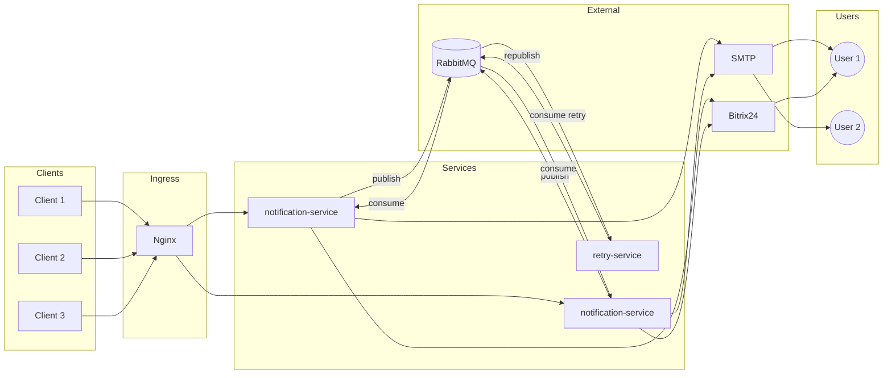

# Архитектура проекта

Этот документ описывает концептуальную архитектуру платформы уведомлений — её цели, структуру, ключевые принципы и роли компонентов.

Он предназначен для:
- новых разработчиков,
- архитекторов,
- DevOps-инженеров,
- специалистов, интегрирующих платформу в другие системы.

> 💡 Документ фокусируется на **«почему» и «как в целом»**, а не на деталях реализации.  
> Технические подробности — в README компонентов и специализированных документах в `docs/`.

## Цель проекта

Платформа обеспечивает **надёжную**, **типобезопасную** и **гибкую** доставку уведомлений пользователям через доступные каналы — на текущий момент **Email** и **Bitrix24 API**.

Доставка управляется **стратегиями** (например, *«отправить в первый доступный канал»* или *«отправить во все доступные»*), что позволяет изменять поведение сервиса **без изменения кода** — только через конфигурацию.

Архитектура изначально спроектирована с расчётом на **горизонтальное расширение**: подключение новых каналов (SMS, Push и др.) не требует переработки ядра. Достаточно реализовать новый адаптер и зарегистрировать его в DI-контейнере.

Отказоустойчивость обеспечивается за счёт асинхронной обработки через **RabbitMQ** и выделенного **retry-сервиса** с поддержкой DLQ (Dead Letter Queue).

## Структура проекта
```
notification-platform/
├── shared/                 # Shared Kernel (DDD): доменные сущности и порты, общие для всех сервисов
├── packages/               # Библиотеки платформы
│   ├── http/               # HTTP-утилиты
│   ├── queues/             # Работа с RabbitMQ
│   └── telemetry/          # Телеметрия
├── services/               # Микросервисы
│   ├── notification-service/  # Основной сервис доставки уведомлений
│   └── retry-service/         # Обработка повторных попыток и DLQ
├── infra/                  # Конфигурации инфраструктуры (RabbitMQ, Keycloak и др.)
├── docs/                   # Архитектурная документация
└── docker-compose.yml      # Локальное развёртывание
```

## Архитектурные принципы

Архитектура сервиса построена вокруг четырёх ключевых идей:

1. **Чистая архитектура**
   Бизнес-логика (`domain`) полностью независима от инфраструктуры. Внешние зависимости (HTTP, очереди, каналы) подключаются через порты и адаптеры.

2. **Shared Kernel как контракт между bounded contexts**
   Общие сущности и порты вынесены в пакет @notification-platform/shared. Он содержит только типы, интерфейсы, enum’ы и pure-функции. Любые изменения в нём требуют согласования, так как затрагивают все сервисы.

3. **Расширяемость через DI и стратегии**
   Поведение сервиса (например, выбор канала доставки) определяется стратегиями, инжектируемыми через DI-контейнер. Это позволяет добавлять новые каналы или менять логику без изменения ядра.

4. **Следование 12-Factor**
   Сервис stateless, конфигурируется через переменные окружения, пишет логи в stdout и готов к развёртыванию в облачных средах с CI/CD.

## Компоненты и взаимодействие

Платформа состоит из следующих архитектурных компонентов, организованных в монорепозитории:

### 1. `shared` — Shared Kernel (DDD)

- **Роль**: Общий контракт между `notification-service` и `retry-service`.
- **Содержит**: доменные сущности (`Notification`, `Contact`), порты (`Producer`, `Logger`), enum’ы (`ChannelType`), типы.
- **Правила**: никаких реализаций, зависимостей или побочных эффектов.

### 2. `packages` — Переиспользуемые библиотеки

- **`http`**: утилиты для Express (middleware, graceful shutdown).
- **`queues`**: реализации `Producer`/`Consumer` для RabbitMQ с поддержкой батчей и retry.
- **`telemetry`**: адаптеры для логирования, трассировки и метрик поверх OpenTelemetry API.
- **Роль**: инкапсулируют общую техническую логику, чтобы сервисы не дублировали код.

### 3. `services` — Микросервисы

#### `notification-service`
- Принимает HTTP-запросы на отправку уведомлений.
- Выбирает канал(ы) доставки по стратегии.
- Публикует сообщения в RabbitMQ для асинхронной обработки или отправляет синхронно.
- Интегрируется с внешними системами через адаптеры:
  - **Email** — через SMTP,
  - **Bitrix24** — через REST API.

#### `retry-service`
- Подписывается на retry-очереди RabbitMQ.
- Повторно публикует сообщения с инкрементом счётчика попыток.
- Маршрутизирует в DLQ после исчерпания лимита.

### 4. `infra` — Инфраструктурные конфигурации

- **Роль**: хранение конфигураций внешних систем, **не кода**.
- **Содержит**:
  - `rabbitmq/` — определения очередей и прав (в формате JSON),
  - `nginx/` — конфигурация прокси (если используется).
- Все файлы монтируются в контейнеры через `docker-compose.yml`.

### 5. Внешние зависимости (не часть кодовой базы)

- **RabbitMQ** — для асинхронной передачи сообщений, retry-механизмов и DLQ.
- **SMTP-сервер** — для отправки email-уведомлений.
- **Bitrix24 API** — для интеграции с CRM и отправки уведомлений через портал.
- **Keycloak** — для аутентификации и авторизации HTTP-запросов (OAuth2/JWT) (опционально).
- **OpenTelemetry Collector** — для агрегации и экспорта телеметрии (опционально).
- **Nginx** — как обратный прокси и TLS-терминатор (опционально).

## Диаграмма компонентов



## Описание процесса работы

Платформа поддерживает два режима обработки уведомлений:

- **Срочные** (`isImmediate: true`) — обрабатываются синхронно и отправляются немедленно.
- **Несрочные** — помещаются в очередь сообщений (RabbitMQ) для асинхронной доставки с гарантией повторных попыток и обработки в dead-letter-очереди (DLQ).

В обоих случаях клиенту **немедленно возвращается подтверждение приёма** (`HTTP 202 Accepted` или `HTTP 207 Multi-Status`), что обеспечивает отзывчивость даже при высокой нагрузке или временных сбоях в каналах доставки.

Фактическая доставка — **асинхронна и надёжна**: ошибки при отправке автоматически повторяются, а проблемные сообщения изолируются для последующего анализа.

## API платформы

HTTP API для отправки уведомлений (по одному или пакетами до 100 сообщений) предоставляется **`notification-service`**.  
Все запросы защищены **JWT-аутентификацией** через Keycloak (требуется валидный токен с ролью `notify`).

> Полная спецификация API (форматы, статусы, примеры) вынесена в отдельный документ: [`api.md`](./api.md).

## Очередь сообщений

Для надёжной асинхронной обработки несрочных уведомлений используется **RabbitMQ** — внешняя система обмена сообщениями.  
Это обеспечивает отказоустойчивость, буферизацию при пиковой нагрузке и гарантию доставки даже при сбоях сервиса.

Конфигурация очередей (включая retry и DLQ) управляется через JSON-файлы в [`infra/rabbitmq/`](../infra/rabbitmq/) и применяется при старте через CI или `docker-compose`.

> Подробности топологии, retry-логики и DLQ — в [`docs/message-queue.md`](./message-queue.md).

## Стратегия доставки уведомлений

Поведение отправки определяется **типобезопасной стратегией**, задаваемой в каждом запросе (`strategy: "sendToFirstAvailable"` и др.).  
Это позволяет гибко управлять доставкой — от отправки в первый доступный канал до параллельной рассылки во все.  
Новые стратегии добавляются как чистые функции и регистрируются в DI-контейнере — без изменения ядра.

> Подробности реализации — в [`docs/strategies.md`](./strategies.md).

## Телеметрия

Платформа обеспечивает наблюдаемость через **логи, метрики и распределённые трейсы** по стандарту **OpenTelemetry**.  
Сбор телеметрии **полностью отделён от бизнес-логики** и не влияет на поведение ядра.  
Все атрибуты и метки автоматически преобразуются в `snake_case` для согласованности.

> Подробности метрик, атрибутов и форматов — в [`docs/telemetry.md`](./telemetry.md).

## Composition Root

Каждый сервис собирается в единой точке — **Composition Root**, расположенной в `composition/`.  
Зависимости (каналы, логгеры, адаптеры) инжектируются в use cases через **чистые фабричные функции**, без использования классов или глобального состояния.  

Этот подход обеспечивает чёткое разделение слоёв, исключает жёсткую связанность и централизует управление жизненным циклом.

> Подробности — в [`docs/composition-root.md`](./composition-root.md).

## Перспективы развития

Архитектура сервиса спроектирована с учётом поэтапного развития. Ниже — ключевые направления, которые уже заложены в текущую структуру или находятся в планах:

### 1. Оркестрация через Kubernetes

- Текущая контейнеризация (Docker) позволяет легко перейти к управлению через Kubernetes.
- Сервис уже соответствует требованиям к stateless-приложениям, healthcheck’ам (`/live`, `/ready`) и логированию в `stdout` — что упрощает интеграцию с K8s.

### 2. Поддержка новых каналов и триггеров

- Архитектура уже позволяет добавлять новые каналы (SMS, Push и др.) без изменения ядра.
- В перспективе — поддержка **входящих триггеров** (например, вебхуки от внешних систем), что потребует расширения `presentation`-слоя, но не затронет `domain`.
