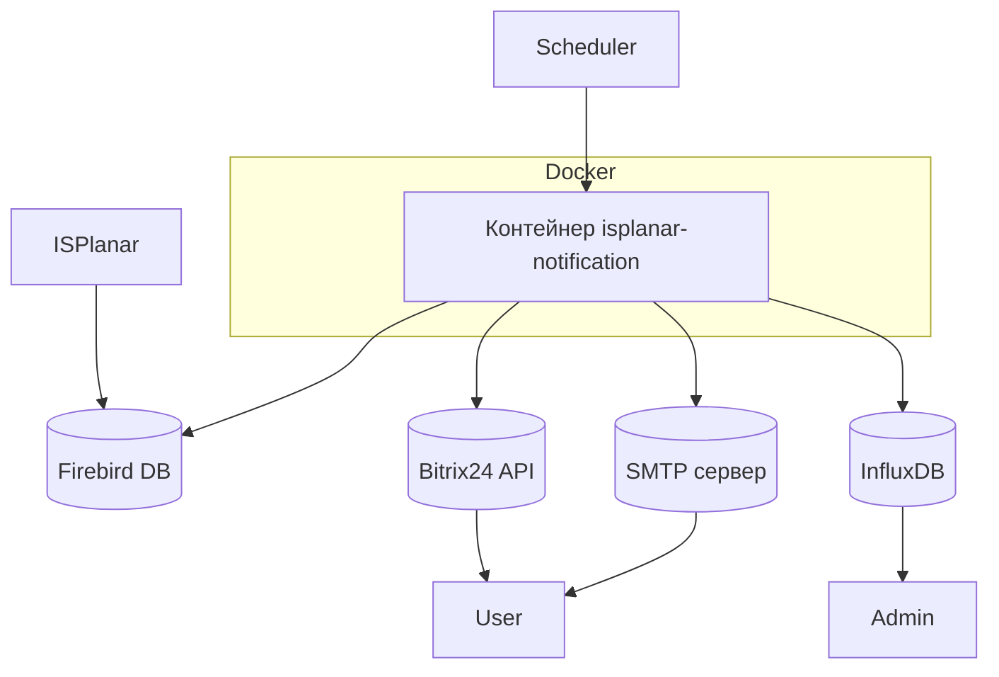

# Архитектура проекта

## Цель проекта

Сервис предназначен для автоматической отправки уведомлений пользователям ISPlanar через Bitrix24 API или Email (резервный канал), основываясь на данных из Firebird-базы.  
Логирование выполнено в InfluxDB для дальнейшего мониторинга через Grafana.

## Структура проекта

```src/
├── application/ # Прикладной уровень: бизнес-логика
│ └── resolvers/
│   └── recipient/ # Contacts -> Recipient[]
│ └── services/
│   ├── notificationDeliveryService/ # Сервис уведомлений
│   ├── notificationProcessService/ # Оркестратор
│   └── notificationLoggerService/ # Логгер

├── domain/ # Доменная модель
│ └── interfaces/ # Абстракции (порты)
│  ├── Notification.ts
│  ├── NotificationSender.ts
│  └── NotificationSource.ts
│ └── types/ # Пользовательские типы
│  └── Recipient.ts

├── infrastructure/ # Инфраструктурные клиенты
│ └── sources/ # Источники уведомлений
│   └── firebirdSource/
│ └── senders/ # Каналы рассылки уведомлений
│   ├── bitrixSender/
│   └── smtpSender/
│ └── fabrics/ # Фабрики
│   ├── loggerFabric.ts
│   ├── senderFabric.ts
│   └── sourceFabric.ts

├── shared/ # Общие абстракции и утилиты
│ └── infrastructure/
│  └── loggers # Логгеры
│   ├── fallbackLogger.ts
│   ├── indluxDbLogger.ts
│   └── localFileLogger.ts
│ └── interfaces/
│  ├── Log.ts
│  └── Logger.ts
│ └── utils/
│  ├── retry.ts
│  └── toSnakeCase.ts

├── configs/ # Конфиги инфраструктурных сущностей

├── containers/ # DI-контейнеры для сбора зависимостей

└── index.ts # Точка входа приложения/Composition Root
```

## Архитектурные принципы

Проект разработан с соблюдением следующих архитектурных подходов:

- **Clean Architecture**: уровни `domain`, `application` и `infrastructure` чётко разделены. Бизнес-логика изолирована от технических деталей реализации.
- **KISS (Keep It Simple, Stupid)**: решения принимаются с учётом простоты. Сложные абстракции добавляются только когда они действительно нужны.
- **DRY (Don't Repeat Yourself)**: повторяющаяся логика выносится в отдельные модули (`fallbackSender`, `resolveRecipients`, `contactResolverMap`) для переиспользования.
- **Частичное применение SOLID**:
  - **SRP (Single Responsibility Principle)**: каждый модуль решает одну задачу и делает это хорошо
  - **OCP (Open/Closed Principle)**: система открыта для расширения, но закрыта для изменения
  - **DIP (Dependency Inversion Principle)**: зависимости внедряются через интерфейсы (`NotificationSource`, `NotificationSender`)
  - **ISP (Interface Segregation Principle)**: интерфейсы содержат только необходимые методы, например, `Contacts` содержит только те поля, которые могут быть у клиента
- **Функциональный стиль**: сервисы реализованы в функциональной парадигме — используются **чистые функции**, **явные зависимости**, **минимизация состояния**
- **Тестируемость**: сервисы легко тестировать благодаря явным зависимостям и функциональной организации кода
- **Масштабируемость**: новые способы доставки, источники данных и стратегии отправки можно добавлять без изменения существующего кода
- **Fail Fast**: ошибки проверяются на этапе создания клиента, чтобы минимизировать риски во время выполнения
- **Fallback Pattern**: логгирование и доставка уведомлений пробуют несколько способов, прежде чем считать операцию неудачной

## Стратегия доставки уведомлений

1. **Приоритет отправки**:

   - Первичный канал: Bitrix24
   - Резервный канал: SMTP
   - Приоритет определяется порядком в массиве `Recipient`, который формируется через `defaultContactResolverMap`. В текущей реализации `bitrix` всегда находится перед `email`.

2. **Количество попыток**:

   - На каждый канал: 1 попытка (можно увеличить с помощью утилиты retry)
   - Если все попытки провалились → записывается лог уровня `Warning` / `Error`

3. **Порядок работы**:

   - Попытка №1: отправка через Bitrix24
   - Если Bitrix24 недоступен → переходим к SMTP
   - Если оба канала упали → выбрасываем ошибку и завершаем работу

4. **Удаление уведомления**:
   - В случае успешно отправки уведомление удаляется
   - В случае неудачи - записывается в DLQ (на данный момент не реализовано)
   - Это гарантирует повторную отправку после вмешательства администратора

## Жизненный цикл уведомления

1. **Получение**:

   - Уведомления берутся из Firebird-БД
   - Используется таблица `NOTIFICATION_QUEUE_S`

2. **Обработка**:

   - Перед отправкой формируется `Recipient`, который определяет, какой канал использовать
   - Логгер пишет событие `notification_delivery_started`

3. **Отправка**:

   - Попытка через Bitrix24
   - Если не удалось — через SMTP
   - В случае успеха: уведомление удаляется из БД
   - В случае ошибки: логируется и записывается в DLQ и удаляется из БД (на данный момент не реализовано)

4. **Логирование**:

   - Все этапы логируются в InfluxDB
   - При падении InfluxDB используется fallback-логгер (localFileLogger)

5. **Завершение**:
   - После обработки всех уведомлений сервис завершает работу
   - Выход через `process.exit(0)` при успехе, `process.exit(1)` при критической ошибке

## Компоненты

1. **Сервис уведомлений (INS)**

   - Описание: Сервис автоматической рассылки уведомлений пользователям ISPlanar через различные каналы связи (Bitrix24, Email). Получает список уведомлений напрямую из базы данных Firebird и поддерживает централизованное логирование в InfluxDB.
   - Технологии: TypeScript + Node.js.
   - Зависимости:
     - Библиотеки: `axios`, `nodemailer`, `node-firebird`, `@influxdata/influxdb-client`, `dotenv`.
     - Инструменты разработки: `eslint`, `prettier`, `jest`, `ts-node`, `nodemon`.

2. **База данных Firebird**

   - Описание: Хранит данные о неподтвержденных уведомлениях, которые необходимо обработать. Также используется для хранения других данных системы ISPlanar.
   - Версия: Firebird 2.5.9.
   - Драйвер: `node-firebird`.

3. **Централизованное логирование (Log)**

   - Описание: Система сбора и хранения логов для мониторинга работы сервиса.
   - Технологии: InfluxDB.
   - Клиентская библиотека: `@influxdata/influxdb-client`.

4. **Каналы отправки уведомлений**
   - **Bitrix24**: Первичный канал отправки уведомлений через API Bitrix24.
     - Библиотека: `axios`.
   - **SMTP**: Резервный канал отправки уведомлений через почтовый сервер.
     - Библиотека `nodemailer`.

---

## Диаграмма компонентов

### 1. Внешняя схема



### 2. Внетренняя схема

````mermaid
graph TD
    subgraph Domain
        INotificationSource[(INotificationSource)]
        INotificationSender[(INotificationSender)]
        ILoggerWriter[(ILoggerWriter)]
        Notification[Notification]
        Recipient[Recipient]
    end

    subgraph Application
        NotificationService[createNotificationService]
        NotificationLoggerClient[createApplicationLogger]
    end

    subgraph Infrastructure
        FirebirdClient[firebirdClient]
        BitrixClient[bitrixClient]
        SmtpClient[smtpClient]
        InfluxDbLogger[influxDbLogger]
        LocalFileLogger[localFileLogger]
    end

    subgraph Shared
        FallbackLogger[fallbackLogger]
        Retry[retry]
    end

    NotificationService -->|uses| INotificationSource
    NotificationLoggerClient -->|uses| ILoggerWriter
    NotificationService -->|uses| INotificationSender
    NotificationService -->|uses| NotificationLoggerClient

    FirebirdClient -.->|implements| INotificationSource
    BitrixClient -.->|implements| INotificationSender
    SmtpClient -.->|implements| INotificationSender
    InfluxDbLogger -.->|implements| ILoggerWriter
    LocalFileLogger -.->|implements| ILoggerWriter

    FallbackLogger -->|wraps multiple loggers| ILoggerWriter
    FallbackLogger --> InfluxDbLogger
    FallbackLogger --> LocalFileLogger

    NotificationService -->|DI через конструктор| BitrixClient
    NotificationService -->|DI через конструктор| SmtpClient
    NotificationService -->|DI через конструктор| FirebirdClient
    NotificationService -->|DI через конструктор| NotificationLoggerClient

    NotificationLoggerClient -->|DI через fallback| ILoggerWriter
    ```

---

## Диаграмма последовательностей

```mermaid
sequenceDiagram
    participant Scheduler as Планировщик
    participant INS as Сервис уведомлений
    participant Firebird as База данных Firebird
    participant Bitrix as Bitrix24 API
    participant SMTP as SMTP сервер
    participant Log as Логирование

    loop Каждые 1-60 секунд
        Scheduler->>INS: Триггер обработки
        INS->>Firebird: Запрос на список уведомлений

        alt Есть уведомления
            Firebird-->>INS: Список уведомлений

            loop Для каждого уведомления
                INS->>Bitrix: Отправка уведомления

                alt Успех
                    Bitrix-->>INS: 200 OK
                    INS->>Log: INFO "Успешная отправка через Bitrix"
                    break
                else Ошибка
                    Bitrix-->>INS: 400 Error
                end

                alt Bitrix не ответил за 3 попытки
                    INS->>SMTP: Отправка уведомления

                    alt Успех
                        SMTP-->>INS: 200 OK
                        INS->>Log: INFO "Успешная отправка через SMTP"
                        break
                    else Ошибка
                        SMTP-->>INS: 400 Error
                    end

                    alt SMTP тоже не ответил
                        INS->>Log: ERROR "Не удалось отправить уведомление"
                    end
                end

                INS->>Firebird: Удаление уведомления
                Firebird-->>INS: Подтверждение удаления
            end
        else Нет уведомлений
            Firebird-->>INS: Пустой список
        end
    end
````

---

## Описание процесса работы системы

1. **Планировщик запускает обработку**:

   - Планировщик (Scheduler) отправляет триггер на запуск обработки каждые 1–60 секунд.

2. **Запрос списка уведомлений**:

   - Сервис уведомлений (INS) выполняет SQL-запрос к базе данных Firebird для получения списка неподтвержденных уведомлений.

3. **Обработка уведомлений**:

   - Если уведомления есть, INS пытается отправить их через Bitrix24 API.
   - При неудачной отправке через Bitrix24 (3 попытки), INS использует резервный канал — SMTP (также 3 попытки).
   - Если оба канала недоступны, записывается ошибка в логи.

4. **Удаление обработанных уведомлений**:

   - После успешной отправки INS выполняет SQL-запрос на удаление уведомления из базы данных Firebird.

5. **Логирование**:
   - Все действия (успешные отправки, ошибки, удаления) логируются в InfluxDB для анализа и мониторинга.

---

## Особенности взаимодействия с базой данных Firebird

1. **Прямые запросы**:

   - Сервис уведомлений (INS) работает с базой данных Firebird напрямую через SQL-запросы. Это вызвано особенностями архитектуры и технологического стека ISPlanar.

2. **Типовые операции**:

   - **Чтение**: Получение списка неподтвержденных уведомлений.
   - **Удаление**: Удаление уведомлений после успешной отправки.

3. **Драйвер**:
   - Используется драйвер `node-firebird` для выполнения SQL-запросов к базе данных Firebird.

---

## Модульная организация и управление зависимостями

Система построена таким образом, чтобы быть гибкой и легко тестируемой. Для этого используется принцип внедрения зависимостей (`Dependency Injection`) и паттерн **фабрик**.

### Использование фабрик

Для инициализации внешних клиентов используются фабричные функции:

- `createDefaultSender()` → создаёт `fallbackSender`
- `createDefaultLogger()` → инициализирует логгер InfluxDB
- `createDefaultSource()` → подключается к Firebird

Это даёт следующие преимущества:

- **Клиенты легко заменить**
- **Минимальное количество глобальных переменных**
- **Удобство тестирования** — можно передавать мокнутые зависимости

Пример:

```ts
const sender = createDefaultSender(bitrixConfig, smtpConfig, onError);
const logger = createDefaultLogger(influxDbLoggerConfig);
const source = createDefaultSource(firebirdConfig);
```

Фабрики находятся в директории `infrastructure/fabrics/`.

---

## Контейнеризация (Docker)

Сервис уведомлений (`isplanar-notification`) может быть запущен в контейнеризованной среде с использованием Docker. Это позволяет унифицировать процесс запуска, изолировать зависимости и использовать один и тот же образ как в development-, так и в production-среде.

### 1. Сборка образа

Образ строится на основе официального образа `node:23.x` и включает:

- Скомпилированный TypeScript код (`dist/`)
- Установленные зависимости (`node_modules`)
- Файлы конфигурации и переменных окружения (не включаются в сам образ, но подставляются при запуске)

Пример команды сборки:

```bash
docker build -t isplanar-notification .
```

### 2. Архитектура контейнера

Контейнер состоит из следующих компонентов:

- **Базовый образ**: `node:23.11.0`
- **Рабочая директория**: `/app`
- **Точка входа**: `npm run start` (для production)
- **Порты**: не публикуются напрямую, т.к. сервис не имеет HTTP-интерфейса
- **Переменные окружения**: передаются через файл `.env` при запуске
- **Монтирование**: не требуется в production, но используется в режиме разработки

### 3. Режимы запуска

#### Production-режим

В этом режиме запускается уже скомпилированное приложение (`dist/index.js`). Используются переменные окружения из `.env`.

```bash
docker run -d \
  --name isplanar-notification \
  --env-file .env \
  isplanar-notification
```

Также можно использовать готовый скрипт `run.sh`, который гарантирует чистый запуск.

#### Development-режим

Режим разработки позволяет монтировать исходный код внутрь контейнера и отслеживать изменения без пересборки образа. Используется `npm run dev` с автоматическим перезапуском.

```bash
docker run -it --rm \
  --name isplanar-notification-dev \
  --env-file ../.env.dev \
  -v $(pwd)/src:/app/src \
  -v $(pwd)/package.json:/app/package.json \
  -v $(pwd)/tsconfig.json:/app/tsconfig.json \
  -w /app \
  node:23.11.0 \
  npm run dev
```

### 4. Интеграция с системой

Контейнер взаимодействует со следующими внешними системами:

| Система           | Тип взаимодействия | Переменная окружения |
| ----------------- | ------------------ | -------------------- |
| Firebird          | SQL-запросы        | FIREBIRD\_\*         |
| Bitrix24 REST API | HTTP-запросы       | BITRIX\_\*           |
| SMTP-сервер       | Отправка email     | SMTP\_\*             |
| InfluxDB          | Логирование метрик | INFLUXDB\_\*         |

### 5. Управление контейнерами

Для управления жизненным циклом контейнера предусмотрены следующие скрипты:

| Скрипт       | Назначение                            |
| ------------ | ------------------------------------- |
| `build.sh`   | Сборка Docker-образа                  |
| `run.sh`     | Запуск контейнера в production-режиме |
| `stop.sh`    | Остановка и удаление контейнера       |
| `restart.sh` | Перезапуск контейнера                 |
| `logs.sh`    | Просмотр логов контейнера             |
| `status.sh`  | Запрос статуса работы контейнера      |

## Метрики и мониторинг

Все события логируются в InfluxDB с такими полями:

- `measurement`: isplanar_notification_logs
- `timestamp`: временная метка
- `tags`:
  - `level`: info, warning, error, critical
  - `currentService`: isplanar-notification
  - `callerService`: имя сервиса, который вызвал отправку уведомлений
  - `trigger`: api, cron, manual
  - `environment`: dev, stage, prod
  - `eventType`: send_bitrix_notification, send_smtp_notification, db_query_error
  - `host`: имя хоста, с которого отправлено событие
  - `traceId`: id трейса
  - `correlationId`: id события в рамках трейса
  - `spanId`: этап, на котором произошло событие
- `fields`:
  - `id`: уникальный ID события
  - `message`: текст уведомления
  - `durationMs`: длительность операции
  - `payload`: данные уведомления
  - `error`: если была ошибка

Графики доступны через Grafana.

## Отказоустойчивость

Сервис рассчитан на работу в условиях возможных сбоев:

| Сценарий                         | Как обрабатывается                                        |
| -------------------------------- | --------------------------------------------------------- |
| Firebird недоступен              | Запросы к БД не выполняются, сервис завершается с кодом 1 |
| Bitrix24 API недоступен          | Используется резервный канал — SMTP                       |
| SMTP недоступен                  | Логируется ошибка                                         |
| InfluxDB недоступен              | Используется fallback-логгер в файл                       |
| Файл логов не может быть записан | Логируется в консоль                                      |

---

## Безопасность

Сервис работает с внешними системами и чувствительными данными, поэтому реализованы следующие меры безопасности:

- **HTTPS для внешних API**: Все запросы к Bitrix24 отправляются через защищённое HTTPS-соединение.
- **Защита секретов через `.env`**: Конфиденциальные данные (SMTP-логины, вебхуки Bitrix24 и т.д.) хранятся во внешнем файле `.env`, не попадающем в репозиторий.
- **Ограничение доступа к Firebird**:
  - Используется служебный пользователь с минимальными привилегиями: только чтение и удаление из таблицы `NOTIFICATION_QUEUE_S`.
  - Сервис работает только во внутренней сети.
- **Безопасное использование SMTP**:
  - Аутентификация через TLS/SSL.
  - Хранение учетных данных — через переменные окружения.

> _Примечание_: Если система будет масштабироваться, можно рассмотреть использование Vault или других решений для управления секретами.

---

## Масштабируемость и расширяемость

### Горизонтальное масштабирование

Сервис является stateless и может быть запущен в нескольких экземплярах одновременно (например, через Docker Swarm или Kubernetes), при этом каждый экземпляр обрабатывает уникальную часть очереди уведомлений.

### Расширяемость архитектуры

- **Добавление новых каналов доставки** (Telegram, SMS и др.) осуществляется путём реализации интерфейса `INotificationSender`.
- **Поддержка новых источников уведомлений** (например, Kafka, RabbitMQ) возможна через реализацию `INotificationSource`.
- **Модульность логгирования** позволяет легко подключать новые способы записи логов через Fallback Pattern.

### Долгосрочные возможности

- Планируемая интеграция с шиной данных (message broker) позволит перейти к более гибкой обработке уведомлений.
- Возможность добавления Web UI для управления правилами отправки и просмотра состояния очереди.

---

## Use Cases / Сценарии использования

> Описание типовых ситуаций, в которых сервис участвует как компонент системы ISPlanar.

| №   | Сценарий                              | Краткое описание                                                                                                               |
| --- | ------------------------------------- | ------------------------------------------------------------------------------------------------------------------------------ |
| 1   | **Уведомление о просроченной задаче** | Сервис получает информацию о просроченной задаче из Firebird, формирует уведомление и отправляет его через Bitrix24 или Email. |
| 2   | **Изменение статуса задачи**          | При изменении статуса задачи (например, "В работе" → "Выполнена") пользователь получает уведомление.                           |
| 3   | **Назначение новой задачи**           | После назначения задачи пользователю он получает соответствующее уведомление.                                                  |
| 4   | **Создание проекта**                  | При создании нового проекта уведомление отправляется всем участникам.                                                          |
| 5   | **Резервная отправка через Email**    | Если Bitrix24 недоступен, уведомление отправляется через SMTP.                                                                 |
