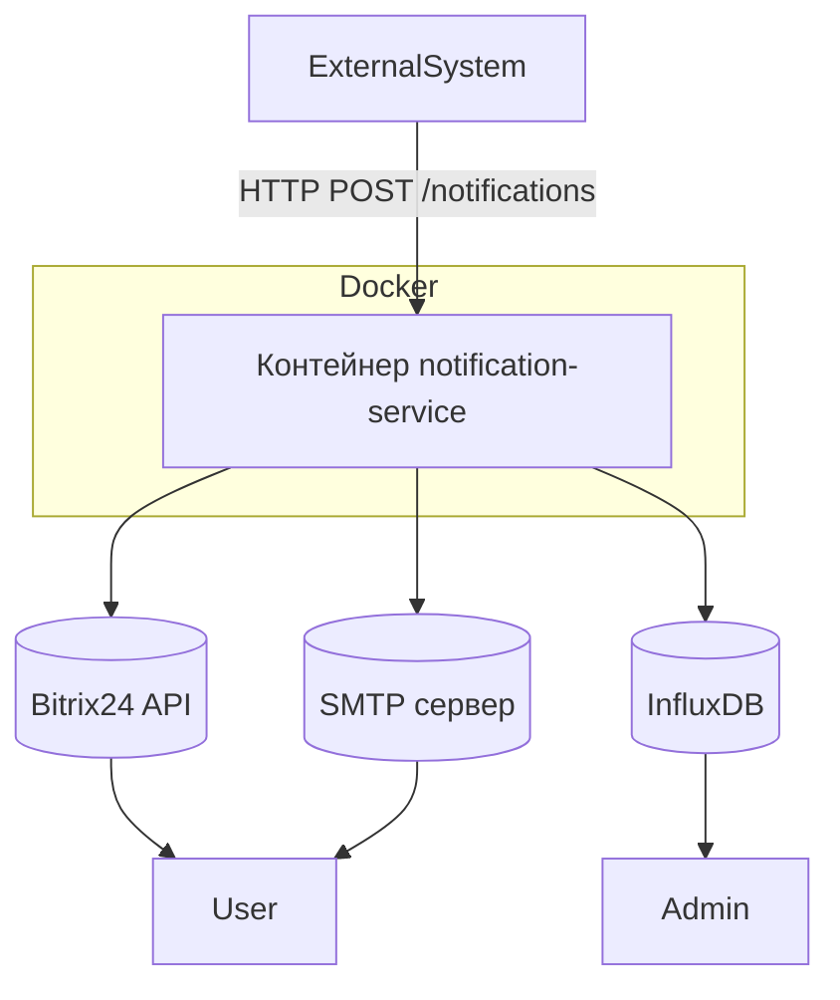
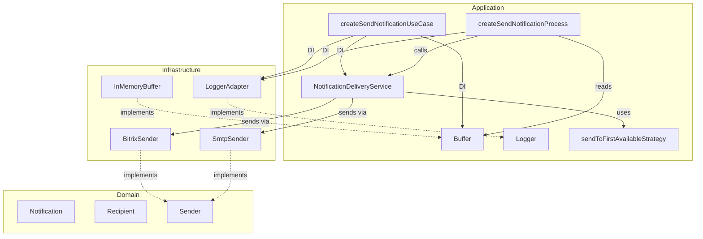

# Архитектура проекта

Этот документ описывает концептуальную архитектуру сервиса уведомлений — его цели, структуру, ключевые принципы и роли компонентов.

Он предназначен для:

- новых разработчиков,
- архитекторов,
- DevOps,
- тех, кто интегрирует сервис в другие системы.

> 💡 Документ фокусируется на **"почему" и "как в целом"**, а не на деталях реализации.  
> Подробности — в соответствующих файлах `docs/`.

> 🎯 Этот документ будет полезен:
>
> - **Разработчику** — чтобы понять, как устроен сервис и где что лежит.
> - **DevOps / SRE** — чтобы понять, как сервис масштабируется и мониторится.
> - **Архитектору** — чтобы оценить применимость в других системах.
> - **Тестировщику** — чтобы понять, какие сценарии покрыты.

## Цель проекта

Сервис предназначен для отправки уведомлений пользователям через Bitrix24 API или Email.
Логирование выполнено в InfluxDB для дальнейшего мониторинга через Grafana.

## Структура проекта

```src/
├── api/ # API
│ ├── openapi/ # Документация Swagger
│ └── schemas/ # ZOD-схемы валидации
├── application/ # Прикладной уровень: бизнес-логика
│ ├── jobs/ # Процессы
│ ├── ports/ # Порты
│ ├── services/ # Сервисы
│ ├── types/ # Типы
│ └── useCases/ # UseCase'ы
├── composition/ # Composition Root
│ ├── bootstrap/ # Запуск приложения
│ ├── container/ # DI-контейнер для управления зависимостями
│ ├── lifecycle/ # Жизненный цикл приложения
│ ├── telemetry/ # Телеметрия
│ └── types/ # Типы
├── configs/ # Конфиги инфраструктурных сущностей
├── domain/ # Доменная модель
│ ├── ports/ # Порты
│ └── types/ # Типы
├── infrastructure/ # Инфраструктурные клиенты
│ ├── buffers/ # Временные хранилища
│ ├── counters/ # Счетчики
│ ├── http/ # Зависимости от фреймворков
│ ├── loggers/ # Логгеры
│ ├── ports/ # Порты
│ ├── senders/ # Каналы рассылки уведомлений
│ ├── telemetry/ # Телеметрия
│ └── types/ # Типы
├── shared/ # Общие абстракции и утилиты
└── index.ts # Точка входа приложения/Composition Root
```

## Архитектурные принципы

Проект построен на фундаментальных подходах, обеспечивающих **поддерживаемость**, **расширяемость** и **независимость от инфраструктуры**.

### Основные подходы

- **Clean Architecture**  
  Чёткое разделение на слои: `domain`, `application`, `infrastructure`, `api`.  
  Бизнес-логика изолирована от внешних деталей (HTTP, базы, очереди).

- **12-Factor App**  
  Сервис соответствует принципам [12-factor](https://12factor.net/):
  - Конфигурация через переменные окружения (`.env`).
  - Отсутствие состояния (stateless).
  - Единый кодбейз, развёртывание через контейнеры.
  - Логирование в `stdout`.  
    Это обеспечивает **переносимость** и **поддержку CI/CD**.

- **Dependency Injection (DI)**  
  Все зависимости передаются явно, что позволяет:
  - Гибко настраивать поведение (например, стратегии доставки).
  - Легко тестировать (подмена моками).
  - Избежать жёсткой связанности.

- **Функциональный стиль и простота**  
  Сервисы реализованы как **чистые функции** с явными зависимостями и минимальным состоянием.  
  Мы следуем принципам **KISS** (Keep It Simple) и **DRY** (Don't Repeat Yourself):
  - Повторяющаяся логика (например, fallback-отправка) вынесена в отдельные модули.
  - Сложные абстракции добавляются только при реальной необходимости.  
    Это упрощает понимание, тестирование и поддержку кода.

## Компоненты

1. **Сервис уведомлений (NS)**
   - Описание: Сервис транзакционной рассылки уведомлений пользователям через различные каналы связи (Bitrix24, Email). Уведомления приходят на сервер по API.
   - Технологии: TypeScript + Node.js.
   - Зависимости:
     - Библиотеки: `axios`, `nodemailer`, `express`, `@influxdata/influxdb-client`, `dotenv`, `awilix`, `opentelemetry`.
     - Инструменты разработки: `eslint`, `prettier`, `vitest`, `ts-node`, `nodemon`.
2. **Централизованное логирование (Log)**
   - Описание: Система сбора и хранения логов для мониторинга работы сервиса.
   - Технологии: InfluxDB.
   - Клиентская библиотека: `@influxdata/influxdb-client`.
3. **Каналы отправки уведомлений**
   - **Bitrix24**: Первичный канал отправки уведомлений через API Bitrix24.
     - Библиотека: `axios`.
   - **SMTP**: Резервный канал отправки уведомлений через почтовый сервер.
     - Библиотека `nodemailer`.

## Диаграмма компонентов

### 1. Внешняя схема



### 2. Внутренняя схема



## Описание процесса работы системы

1. **Получение списка уведомлений**:
   - Сервис уведомлений (NS) получает уведомления от внешних систем через HTTP-запрос `POST /notifications`.
2. **Обработка уведомлений**:
   - Для каждого получателя NS применяет **настроенную стратегию доставки**.
   - По умолчанию используется стратегия `sendToFirstAvailableStrategy`, которая последовательно пробует доступные каналы.
   - Если ни один канал не сработал — записывается ошибка.
3. **Ответ клиенту**:
   - Уведомления проверяются на валидность.
   - Срочные (`isUrgent: true`) — отправляются немедленно.
   - Несрочные — помещаются в буфер для пакетной отправки.
   - Клиенту возвращается 202 Accepted (если есть валидные), 207 Multi-Status (если часть невалидна) или 400 Bad Request (если невалидны все уведомления).
   - Фактическая доставка происходит асинхронно.
4. **Логирование**:
   - Все действия (успешные отправки, ошибки, удаления) логируются в InfluxDB для анализа и мониторинга.

## Модульная организация и управление зависимостями

Система построена таким образом, чтобы быть гибкой и легко тестируемой. Для этого используется принцип внедрения зависимостей (`Dependency Injection`) и паттерн **фабрик**.

### Управление зависимостями через DI-контейнер

Для инициализации внешних клиентов используются фабричные функции:

Это даёт следующие преимущества:

- **Клиенты легко заменить**
- **Минимальное количество глобальных переменных**
- **Удобство тестирования** — можно передавать мокнутые зависимости

Пример:

```ts
container.register({
  bitrixSender: asFunction(({ bitrixConfig }) =>
    createBitrixSender(bitrixConfig),
  ).singleton(),
  smtpSender: asFunction(({ smtpConfig }) =>
    createSmtpSender(smtpConfig),
  ).singleton(),
  notificationDeliveryService: asFunction(
    ({ bitrixSender, smtpSender, loggerAdapter }) =>
      createNotificationDeliveryService(
        [bitrixSender, smtpSender],
        loggerAdapter,
      ),
  ).singleton(),
});
```

## API сервиса

API сервиса уведомлений предоставляет простой HTTP-интерфейс для отправки уведомлений различным получателям (email, Bitrix24 и др.). Основной эндпоинт `/v1/notifications` принимает как одиночные, так и пакетные уведомления (до 100 за раз), обеспечивая гибкость и эффективность при интеграции.

Сервис реализован на **Express.js** благодаря его лёгкости и быстроте, что соответствует требованиям к минимальному оверхеду и высокой производительности. Архитектура API строится вокруг принципов REST и HTTP-семантики: используются стандартные статус-коды, middleware-обработка (валидация, rate limiting, логирование) и healthcheck-эндпоинты для оркестрации.

Для удобства разработчиков и автоматизации интеграции предоставлена **полная OpenAPI-спецификация (Swagger)**, доступная в интерактивной форме по адресу `/api-docs`. Она включает:

- точные схемы запросов и ответов,
- примеры использования,
- описания всех эндпоинтов и статусов.

> 💡 Подробная документация API, включая форматы запросов, коды ответов и примеры, вынесена в отдельный файл: [`api.md`](./api.md).

## Стратегия доставки уведомлений

Сервис поддерживает **гибкие стратегии доставки уведомлений**, позволяя настраивать поведение отправки в зависимости от требований (например, приоритетность каналов, отказоустойчивость, параллельная отправка и т.д.).

По умолчанию используется стратегия **"отправить первому доступному"** (`sendToFirstAvailableStrategy`), при которой:

- Попытка отправки осуществляется через первый рабочий канал из списка.
- Если канал недоступен — происходит переход к следующему.
- Отправка считается успешной при удачной доставке хотя бы одним способом.

Количество попыток на канал — 1 (может быть увеличено с помощью утилиты `retry`).

> Поддержка других стратегий (например, "отправить всем", "по расписанию", "с экспоненциальной задержкой") может быть добавлена без изменения основного кода сервиса.

> 💡 Подробная документация по реализованным стратегиям доступна в: [`docs/strategies.md`](./strategies.md).

## Буферизация и батчинг

Для несрочных уведомлений (`isUrgent: false` или отсутствует) используется **InMemoryBuffer** — временное хранилище в памяти.

- Уведомления помещаются в буфер при получении.
- Раз в `PROCESS_BATCHING_INTERVAL` (по умолчанию 60 сек) фоновый процесс забирает все уведомления и отправляет их пачкой.
- Это позволяет снизить нагрузку на внешние API (Bitrix, SMTP) и избежать "флуда".

> ⚠️ При перезапуске сервиса уведомления в буфере **теряются**.  
> Для полной отказоустойчивости в будущем можно заменить на персистентное хранилище (Redis, Kafka).

## Контейнеризация

Сервис уведомлений разработан как контейнеризованное приложение и запускается в среде Docker. Это обеспечивает:

- **Единообразие** между development, staging и production-средами.
- **Изоляцию зависимостей** и предсказуемость поведения.
- **Поддержку автоматизированного развёртывания** через CI/CD и оркестраторы (например, Kubernetes).

Контейнер содержит скомпилированное приложение на Node.js и взаимодействует с внешними системами (Bitrix24, SMTP, InfluxDB) через переменные окружения. Все конфигурационные параметры передаются при запуске, что соответствует [12-factor app methodology](https://12factor.net/). Шаблон конфигурации: env.example.

> 💡 Подробная документация по сборке, запуску и управлению контейнером доступна в: [`docs/docker.md`](./docker.md).

## Телеметрия

Сервис обеспечивает полную наблюдаемость через **структурированное логирование**, **сквозную корреляцию** и **отказоустойчивую запись событий**.

Ключевые принципы:

- **Чистота бизнес-логики**: сбор телеметрии не засоряет use cases и domain-слой.
- **Прозрачная инструментация**: критические компоненты — отправители (`senders`) и буферы (`buffers`) — автоматически оборачиваются **декораторами телеметрии** при сборке приложения. Эти обёртки добавляют контекст (`traceId`, `spanId`, `durationMs`) и фиксируют события без вмешательства в основную логику.
- **Fail-safe logging**: даже при недоступности внешних систем логи не теряются благодаря fallback-цепочке (InfluxDB → файл → stdout).

### Что включает телеметрия:

- **Структурированные логи** с индексируемыми тегами: уровень (`level`), окружение (`environment`), тип события (`eventType`), хост и др.
- **Сквозная трассировка** через `traceId` (OpenTelemetry) и `correlationId` (бизнес-идентификатор), что упрощает диагностику в распределённой системе.
- **Визуализация в реальном времени** через Grafana с возможностью фильтрации, поиска и анализа по любому полю.
- **Алертинг в Telegram** для событий уровня `error` и `critical` (только в production).

> 💡 Подробная схема полей, тегов, формата лога и описание дашбордов — в отдельном документе: [`docs/telemetry.md`](./telemetry.md).

## Отказоустойчивость

Сервис уведомлений устойчив к частичным сбоям внешних систем благодаря:

- **Fallback-цепочкам** при отправке (переход к резервному каналу) и логировании (InfluxDB → файл → stdout).
- **Гибкой обработке ошибок** — сбой одного канала не останавливает обработку.
- **Сквозной трассировке** с `traceId` и `correlationId` для диагностики.
- **Алертингу** на критические ошибки.

Архитектура гарантирует, что уведомление будет доставлено, если хотя бы один канал доступен, а логи — записаны, даже если основная система недоступна.

> 💡 Подробнее — в: [`docs/resilience.md`](./resilience.md).

## Безопасность

Сервис обеспечивает защиту чувствительных данных и соединений за счёт:

- **Изолированного хранения секретов** через `.env` (не в коде).
- **Шифрования трафика** через HTTPS (внешние вызовы) и TLS-терминацию на уровне nginx.
- **Безопасной аутентификации** с SMTP-сервером.
- **Работы в доверенной сети** (пока без аутентификации входящих запросов).

Архитектура спроектирована с учётом будущего масштабирования: при необходимости можно интегрировать Vault, API-ключи или JWT.

> 💡 Подробнее — в: [`docs/security.md`](./security.md).

## Масштабируемость и расширяемость

Сервис в целом **stateless**, за исключением **InMemoryBuffer**, который хранит несрочные уведомления до отправки.

Архитектура поддерживает:

- **Гибкое добавление новых каналов** (Telegram, SMS и др.) через интерфейс `NotificationSender`.
- **Подменяемые стратегии доставки** (например, "первый доступный", "все каналы").
- **Модульное логирование** с поддержкой fallback-цепочек.

Это позволяет адаптировать сервис под растущие нагрузки и новые требования, не нарушая существующей логики.

> 💡 Подробнее — в: [`docs/scalability.md`](./scalability.md).

## Use Cases: Ретрансляция уведомлений

Сервис уведомлений **не инициирует** отправку и **не знает о бизнес-событиях**. Он является **пассивным ретранслятором (dumb pipe)**, который:

- Принимает уведомления от ERP и других систем.
- Доставляет их получателям через Bitrix24, email и другие каналы.
- Гарантирует доставку по первому рабочему каналу.
- Возвращает статус приёма в обработку.

Сейчас реализованы два сценария:

1. Уведомление коммерсантов при присвоении серийного номера.
2. Уведомление руководителя производства при создании спецификации.

Архитектура "глупого сервиса" обеспечивает простоту, надёжность и независимость от источников уведомлений.

> 💡 Подробности — в: [`docs/use-cases.md`](./use-cases.md).

## Composition Root: сборка приложения

Все компоненты приложения (каналы отправки, логгеры, use cases) собираются в одном месте — **Composition Root**.

Здесь:

- Реализации инжектируются в use cases.
- Настраивается fallback-логика и стратегии доставки.
- Формируется готовый HTTP-сервер.

Сборка реализована с помощью **[Awilix](https://github.com/jeffijoe/awilix)** — DI-контейнера, который управляет зависимостями и их жизненным циклом.

Это обеспечивает:

- Чёткое разделение ответственности.
- Гибкость и тестируемость.
- Единое место управления зависимостями.

> 💡 Подробнее — в: [`docs/composition-root.md`](./composition-root.md).
