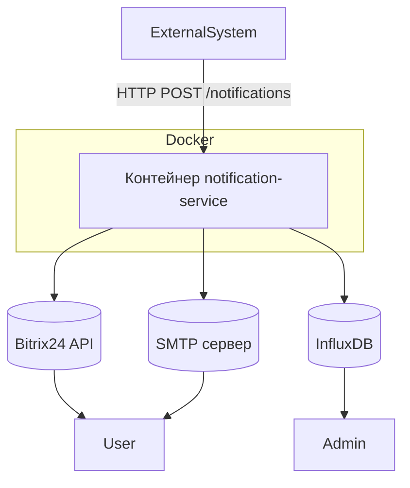
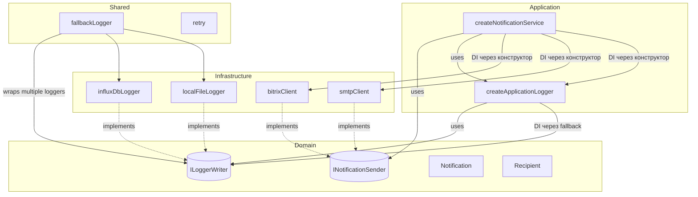
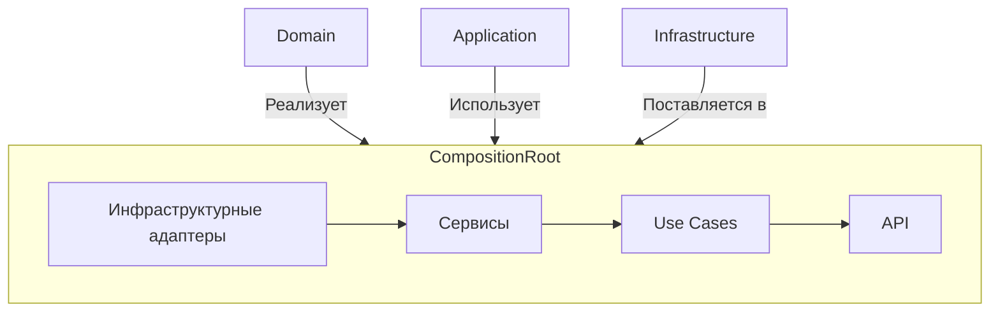

# Архитектура проекта

## Цель проекта

Сервис предназначен для транзакционной рассылки уведомлений пользователям через Bitrix24 API или Email.  
Логирование выполнено в InfluxDB для дальнейшего мониторинга через Grafana.

## Структура проекта

```src/
├── api/ # API
│ ├── openapi/ # Документация Swagger
│ └── schemas/ # ZOD-схемы валидации
├── application/ # Прикладной уровень: бизнес-логика
│ └── services/
│   ├── notificationDeliveryService/ # Сервис уведомлений
│   └── notificationLoggerService/ # Логгер
│ └── useCases/ # UseCase'ы
├── composition/ # Composition Root
│   ├── bootstrap/ # Запуск приложения
│   ├── core/ # Singleton'ы ядра приложения (сервисы, use cases)
│   ├── server/ # Singleton'ы HTTP-сервера и его зависимостей
├── configs/ # Конфиги инфраструктурных сущностей
├── domain/ # Доменная модель
│ └── interfaces/ # Абстракции (порты)
│ └── types/ # Пользовательские типы
├── infrastructure/ # Инфраструктурные клиенты
│ └── http/ # Зависимости от фреймворков
│   └── express/
│ └── senders/ # Каналы рассылки уведомлений
│   ├── bitrixSender/
│   └── smtpSender/
├── shared/ # Общие абстракции и утилиты
│ └── enums/
│ └── infrastructure/
│  └── loggers # Логгеры
│ └── interfaces/
│ └── utils/
└── index.ts # Точка входа приложения/Composition Root
```

## Архитектурные принципы

Проект разработан с соблюдением следующих архитектурных подходов:

- **Clean Architecture**: уровни `domain`, `application`, `api` и `infrastructure` чётко разделены. Бизнес-логика изолирована от технических деталей реализации.
- **KISS (Keep It Simple, Stupid)**: решения принимаются с учётом простоты. Сложные абстракции добавляются только когда они действительно нужны.
- **DRY (Don't Repeat Yourself)**: повторяющаяся логика выносится в отдельные модули (например, `fallbackSender`) для переиспользования.
- **Частичное применение SOLID**:
  - **SRP (Single Responsibility Principle)**: каждый модуль решает одну задачу
  - **OCP (Open/Closed Principle)**: система открыта для расширения, но закрыта для изменения
  - **DIP (Dependency Inversion Principle)**: зависимости внедряются через интерфейсы (например, `NotificationSender`)
  - **ISP (Interface Segregation Principle)**: интерфейсы содержат только необходимые методы, например, `Recipients` содержит только те поля, которые могут быть у клиента
- **Функциональный стиль**: сервисы реализованы в функциональной парадигме — используются **чистые функции**, **явные зависимости**, **минимизация состояния**
- **Тестируемость**: сервисы легко тестировать благодаря явным зависимостям и функциональной организации кода
- **Fail Fast**: ошибки проверяются на этапе создания клиента, чтобы минимизировать риски во время выполнения
- **Масштабируемость**: новые способы доставки, источники данных и стратегии отправки можно добавлять без изменения существующего кода
- **Поддержка стратегий доставки**:
  - Логика отправки уведомлений отделена от сервиса через стратегии
  - Возможна гибкая настройка поведения доставки (например: "отправить первому доступному", "отправить всем", "по приоритету")
  - Новые стратегии можно добавлять без изменения кода сервиса
- **Composition Root**:
  - Все зависимости создаются в одном месте
  - Конкретные реализации инжектятся через абстракции
  - Отсутствие "new" в бизнес-логике

## API сервиса

### Эндпоинт `POST /notifications`

Эндпоинт принимает HTTP POST запросы с данными уведомления.

#### Заголовки:

- `Content-Type: application/json`

#### Тело запроса:

```json
{
  "recipients": [
    {
      "type": "bitrix",
      "value": "12345"
    },
    {
      "type": "email",
      "value": "user@example.com"
    }
  ],
  "message": "Текст уведомления"
}
```

#### Варианты ответа:

- `201 Created`: Уведомление успешно обработано
- `400 Bad Request`: Ошибка валидации (например, неверный формат email или отсутствие обязательных полей)
- `404 Not Found`: Запрашиваемый ресурс не найден
- `429 Too Many Requests`: Превышен лимит запросов (rate limit)
- `500 Internal Server Error`: Внутренняя ошибка сервера

---

### Системные эндпоинты (Healthcheck)

#### Эндпоинт `GET /health/live`

Позволяет проверить, запущен ли сервис и работает ли он на базовом уровне.

##### Ответы:

- `200 OK`: Сервис жив и отвечает на запросы.

##### Использование:

Как правило, используется системами оркестрации (например, Kubernetes) для проверки жизнеспособности контейнера.

---

#### Эндпоинт `GET /health/ready`

Позволяет проверить, готов ли сервис к полноценной обработке запросов. Может включать проверку подключения к зависимостям (базы данных, внешние сервисы и т.д.).

##### Ответы:

- `200 OK`: Сервис готов к обработке запросов.
- `503 Service Unavailable`: Сервис временно не доступен (например, зависает зависимость).

##### Использование:

Используется для определения того, можно ли направлять трафик на этот экземпляр сервиса.

---

### Документация

Полная спецификация доступна по адресу `/docs` в формате Swagger UI.

---

### Реализованные middleware

Все входящие запросы проходят через следующие обработчики на уровне middleware:

1. **Логгирование всех запросов** — фиксируются метаданные запроса для последующего анализа.
2. **Проверка rate limit** — ограничение количества запросов от одного клиента во избежание перегрузки сервиса.
3. **Перехват ошибки 404** — если запрашиваемый эндпоинт не найден, клиент получает корректный HTTP-ответ.
4. **Перехват ошибки 500** — глобальный обработчик неожиданных исключений, предотвращающий падение сервиса.
5. **Проверка тела request** — валидация JSON и структуры данных перед дальнейшей обработкой.

## Стратегия доставки уведомлений

Сервис поддерживает **гибкие стратегии доставки уведомлений**, позволяя настраивать поведение отправки в зависимости от требований (например, приоритетность каналов, отказоустойчивость, параллельная отправка и т.д.).

По умолчанию используется стратегия **"отправить первому доступному"** (`sendToFirstAvailableStrategy`), при которой:

- Попытка отправки осуществляется через первый рабочий канал из списка.
- Если канал недоступен — происходит переход к следующему.
- Отправка считается успешной при удачной доставке хотя бы одним способом.

Количество попыток на канал — 1 (может быть увеличено с помощью утилиты `retry`).

> Поддержка других стратегий (например, "отправить всем", "по расписанию", "с экспоненциальной задержкой") может быть добавлена без изменения основного кода сервиса.

## Компоненты

1. **Сервис уведомлений (NS)**
   - Описание: Сервис транзакционной рассылки уведомлений пользователям через различные каналы связи (Bitrix24, Email). Уведомления приходят на сервер по API.
   - Технологии: TypeScript + Node.js.
   - Зависимости:
     - Библиотеки: `axios`, `nodemailer`, `express`, `@influxdata/influxdb-client`, `dotenv`.
     - Инструменты разработки: `eslint`, `prettier`, `vitest`, `ts-node`, `nodemon`.
2. **Централизованное логирование (Log)**
   - Описание: Система сбора и хранения логов для мониторинга работы сервиса.
   - Технологии: InfluxDB.
   - Клиентская библиотека: `@influxdata/influxdb-client`.
3. **Каналы отправки уведомлений**
   - **Bitrix24**: Первичный канал отправки уведомлений через API Bitrix24.
     - Библиотека: `axios`.
   - **SMTP**: Резервный канал отправки уведомлений через почтовый сервер.
     - Библиотека `nodemailer`.

## Диаграмма компонентов

### 1. Внешняя схема



### 2. Внетренняя схема



## Описание процесса работы системы

1. **Получение списка уведомлений**:
   - Сервис уведомлений (NS) получает уведомления от внешних систем через HTTP-запрос `POST /notifications`.
2. **Обработка уведомлений**:
   - Для каждого получателя NS применяет **настроенную стратегию доставки**.
   - По умолчанию используется стратегия `sendToFirstAvailableStrategy`, которая последовательно пробует доступные каналы.
   - Если ни один канал не сработал — записывается ошибка.
3. **Ответ клиенту**:
   - После обработки всех уведомлений NS отправляет статус HTTP 201 Created.
4. **Логирование**:
   - Все действия (успешные отправки, ошибки, удаления) логируются в InfluxDB для анализа и мониторинга.

## Модульная организация и управление зависимостями

Система построена таким образом, чтобы быть гибкой и легко тестируемой. Для этого используется принцип внедрения зависимостей (`Dependency Injection`) и паттерн **фабрик**.

### Использование фабрик

Для инициализации внешних клиентов используются фабричные функции:

Это даёт следующие преимущества:

- **Клиенты легко заменить**
- **Минимальное количество глобальных переменных**
- **Удобство тестирования** — можно передавать мокнутые зависимости

Пример:

```ts
const sender = getSenderInstance(bitrixConfig, smtpConfig, onError);
const logger = getLoggerInstance(influxDbLoggerConfig);
```

---

## Контейнеризация (Docker)

Сервис уведомлений (`notification-service`) может быть запущен в контейнеризованной среде с использованием Docker. Это позволяет унифицировать процесс запуска, изолировать зависимости и использовать один и тот же образ как в development-, так и в production-среде.

### 1. Сборка образа

Образ строится на основе официального образа `node:23.x` и включает:

- Скомпилированный TypeScript код (`dist/`)
- Установленные зависимости (`node_modules`)
- Файлы конфигурации и переменных окружения (не включаются в сам образ, но подставляются при запуске)

Пример команды сборки:

```bash
docker build -t notification-service .
```

### 2. Архитектура контейнера

Контейнер состоит из следующих компонентов:

- **Базовый образ**: `node:23.11.0`
- **Рабочая директория**: `/app`
- **Точка входа**: `npm run start` (для production)
- **Порты**: не публикуются напрямую, т.к. сервис не имеет HTTP-интерфейса
- **Переменные окружения**: передаются через файл `.env` при запуске
- **Монтирование**: не требуется в production, но используется в режиме разработки

### 3. Режимы запуска

#### Production-режим

В этом режиме запускается уже скомпилированное приложение (`dist/index.js`). Используются переменные окружения из `.env`.

```bash
docker run -d \
  --name notification-service \
  --env-file ../.env \
  -p "$PORT:$PORT" \
  notification-service
```

Также можно использовать готовый скрипт `run.sh`, который гарантирует чистый запуск.

> Контейнер использует переменные из `.env`. Убедитесь, что файл существует.

#### Development-режим

Режим разработки позволяет монтировать исходный код внутрь контейнера и отслеживать изменения без пересборки образа. Используется `npm run dev` с автоматическим перезапуском.

```bash
docker run -it --rm \
  --name notification-service-dev \
  --env-file ../.env.dev \
  -v $(pwd)/src:/app/src \
  -v $(pwd)/package.json:/app/package.json \
  -v $(pwd)/tsconfig.json:/app/tsconfig.json \
  -w /app \
  node:23.11.0 \
  npm run dev
```

### 4. Интеграция с системой

Контейнер взаимодействует со следующими внешними системами:
| Система | Тип взаимодействия | Переменная окружения |
| ----------------- | ------------------ | -------------------- |
| Bitrix24 REST API | HTTP-запросы | BITRIX\_\* |
| SMTP-сервер | Отправка email | SMTP\_\* |
| InfluxDB | Логирование метрик | INFLUXDB\_\* |

### 5. Управление контейнерами

Для управления жизненным циклом контейнера предусмотрены следующие скрипты:
| Скрипт | Назначение |
| ------------ | ------------------------------------- |
| `build.sh` | Сборка Docker-образа |
| `run.sh` | Запуск контейнера в production-режиме |
| `stop.sh` | Остановка и удаление контейнера |
| `restart.sh` | Перезапуск контейнера |
| `logs.sh` | Просмотр логов контейнера |
| `status.sh` | Запрос статуса работы контейнера |

## Метрики и мониторинг

Все события логируются в InfluxDB с такими полями:

- `measurement`: notification_service_logs
- `timestamp`: временная метка
- `tags`:
  - `level`: info, warning, error, critical
  - `currentService`: notification-service
  - `callerService`: имя сервиса, который вызвал отправку уведомлений
  - `trigger`: api, cron, manual
  - `environment`: dev, stage, prod
  - `eventType`: send_bitrix_notification, send_smtp_notification, db_query_error
  - `host`: имя хоста, с которого отправлено событие
  - `traceId`: id трейса
  - `correlationId`: id события в рамках трейса
  - `spanId`: этап, на котором произошло событие
- `fields`:
  - `id`: уникальный ID события
  - `message`: текст уведомления
  - `durationMs`: длительность операции
  - `payload`: данные уведомления
  - `error`: если была ошибка

Графики доступны через Grafana.

## Отказоустойчивость

Сервис рассчитан на работу в условиях возможных сбоев:
| Сценарий | Как обрабатывается |
| -------------------------------- | ----------------------------------- |
| Bitrix24 API недоступен | Используется резервный канал — SMTP |
| SMTP недоступен | Логируется ошибка |
| InfluxDB недоступен | Используется fallback-логгер в файл |
| Файл логов не может быть записан | Логируется в консоль |

## Безопасность

Сервис работает с внешними системами и чувствительными данными, поэтому реализованы следующие меры безопасности:

- **HTTPS для внешних API**: Все запросы к Bitrix24 отправляются через защищённое HTTPS-соединение.
- **Защита секретов через `.env`**: Конфиденциальные данные (SMTP-логины, вебхуки Bitrix24 и т.д.) хранятся во внешнем файле `.env`, не попадающем в репозиторий.
- **Безопасное использование SMTP**:
  - Аутентификация через TLS/SSL.
  - Хранение учетных данных — через переменные окружения.

> _Примечание_: Если система будет масштабироваться, можно рассмотреть использование Vault или других решений для управления секретами.

## Масштабируемость и расширяемость

### Горизонтальное масштабирование

Сервис является stateless и может быть запущен в нескольких экземплярах одновременно (например, через Docker Swarm или Kubernetes), при этом каждый экземпляр обрабатывает уникальную часть очереди уведомлений.

### Расширяемость архитектуры

- **Добавление новых каналов доставки** (Telegram, SMS и др.) осуществляется путём реализации интерфейса `NotificationSender`.
- **Модульность логгирования** позволяет легко подключать новые способы записи логов через Fallback Pattern.
- **Поддержка стратегий доставки**:
  - Поведение отправки можно изменить, передав другую стратегию при создании сервиса.
  - Новые стратегии реализуются отдельно и внедряются через параметр `strategy` в `createNotificationDeliveryService` путём реализации интерфейса `DeliveryStrategy`.

### Долгосрочные возможности

- Планируемая интеграция с шиной данных (message broker) позволит перейти к более гибкой обработке уведомлений.
- Возможность добавления Web UI для управления правилами отправки и просмотра состояния очереди.

## Use Cases / Сценарии использования

> Описание типовых ситуаций, в которых сервис участвует как компонент системы ISPlanar.
> | № | Сценарий | Краткое описание |
> | --- | ------------------------------------- | ------------------------------------------------------------------------------------------------------------------ |
> | 1 | **Уведомление о просроченной задаче** | Сервис получает информацию о просроченной задаче, формирует уведомление и отправляет его через Bitrix24 или Email. |
> | 2 | **Изменение статуса задачи** | При изменении статуса задачи (например, "В работе" → "Выполнена") пользователь получает уведомление. |
> | 3 | **Назначение новой задачи** | После назначения задачи пользователю он получает соответствующее уведомление. |
> | 4 | **Создание проекта** | При создании нового проекта уведомление отправляется всем участникам. |
> | 5 | **Резервная отправка через Email** | Если Bitrix24 недоступен, уведомление отправляется через SMTP. |

## Composition Root

Это место, где собираются все компоненты системы. Здесь:

1. Создаются конкретные реализации абстракций
2. Инжектятся зависимости
3. Настраивается взаимодействие между слоями

### Принципы:

- **Единственное место сборки** — все зависимости создаются только здесь
- **Инверсия управления** — высокоуровневые модули получают зависимости через интерфейсы
- **Изоляция от бизнес-логики** — код Composition Root не содержит доменных правил

### Пример работы:

```typescript
// composition/server/server.ts
export const createDefaultServer = () => {
  // 1. Создаем инфраструктурные адаптеры
  const bitrixSender = createBitrixSender(config);
  const smtpSender = createSmtpSender(config);

  // 2. Собираем сервисы
  const logger = createLogger();
  const fallbackSender = createFallbackSender([bitrixSender, smtpSender]);

  // 3. Создаем use case
  const useCase = createSendNotificationUseCase({
    sender: fallbackSender,
    logger,
  });

  // 4. Возвращаем готовый сервер
  return createExpressServer(useCase);
};
```

### Расположение в архитектуре:


