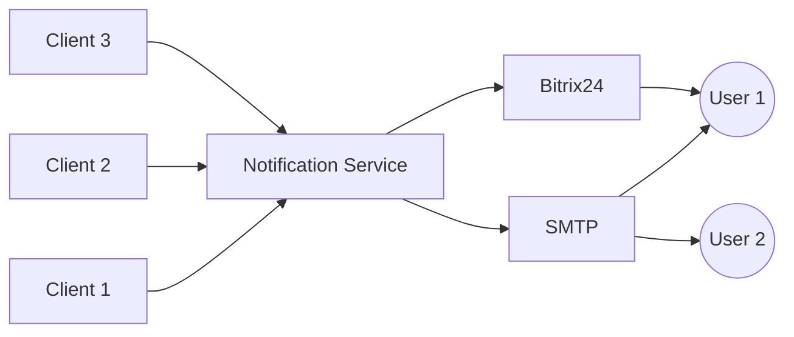

# Архитектура проекта

Этот документ описывает концептуальную архитектуру сервиса уведомлений — его цели, структуру, ключевые принципы и роли компонентов.

Он предназначен для:

- новых разработчиков,
- архитекторов,
- DevOps,
- тех, кто интегрирует сервис в другие системы.

> 💡 Документ фокусируется на **"почему" и "как в целом"**, а не на деталях реализации.  
> Подробности — в соответствующих файлах `docs/`.

## Цель проекта

Сервис обеспечивает надёжную, типобезопасную и гибкую отправку уведомлений пользователям через доступные каналы — на текущий момент Email и Bitrix24.

**Ключевая особенность архитектуры — управление доставкой через стратегии.**

Вместо жестко заданной логики отправки, сервис позволяет определять критерии успеха динамически, на уровне каждого запроса:

- **Гибкость:** Клиент сам выбирает стратегию (`send_to_first_available`, `send_to_all_available` и др.) в зависимости от важности уведомления.
- **Надёжность:** Стратегии обеспечивают устойчивость к сбоям отдельных каналов (например, автоматический перебор контактов при ошибке SMTP).
- **Конфигурируемость:** Поведение системы меняется без изменения кода ядра — достаточно выбрать нужную стратегию в запросе или настроить дефолтную в конфигурации.

Архитектура изначально спроектирована для горизонтального масштабирования функциональности:

- Подключение новых каналов (SMS, Telegram, Push) требует только реализации нового адаптера.
- Добавление новых сценариев доставки реализуется через создание новой стратегии.
- Оба типа расширений регистрируются через DI-контейнер и сразу становятся доступны во всей системе без модификации существующего кода (принцип Open/Closed).

## Структура проекта

```src/
├── application/ # Прикладной уровень: бизнес-логика
├── compositionRoot/ # Логика сборки приложения
├── domain/ # Доменная модель
├── infrastructure/ # Реализация инфраструктурных клиентов
├── presentation/ # Интерфейс пользователя (Swagger)
├── instrumentation.ts # Запуск OTelSDK
└── index.ts # Точка входа приложения
```

## Архитектурные принципы

Архитектура сервиса построена вокруг трех ключевых идей:

1. **Чистая архитектура**
   Бизнес-логика (`domain`) полностью независима от инфраструктуры. Внешние зависимости (HTTP, очереди, каналы) подключаются через порты и адаптеры.

2. **Расширяемость через DI и стратегии**
   Поведение сервиса (например, выбор канала доставки) определяется стратегиями, инжектируемыми через DI-контейнер. Это позволяет добавлять новые каналы или менять логику без изменения ядра.

3. **Следование 12-Factor**
   Сервис stateless, конфигурируется через переменные окружения, пишет логи в stdout и готов к развёртыванию в облачных средах с CI/CD.

## Диаграмма компонентов


```mermaid
flowchart LR
    Client1[Client 1] --> NS[Notification Service]
    Client2[Client 2] --> NS
    Client3[Client 3] --> NS

    NS --> SMTP[SMTP]
    NS --> Bitrix24[Bitrix24]

    SMTP --> User1((User 1))
    Bitrix24 --> User1

    SMTP --> User2((User 2))
```

## Стратегия доставки уведомлений

**Стратегия — это ключевая архитектурная фича сервиса, определяющая алгоритм взаимодействия с каналами связи для каждого конкретного уведомления.**

Вместо жестко зашитой логики отправки, сервис делегирует решение о том, как и когда считать доставку успешной, самому клиенту через параметр `strategy`. Это позволяет решать разные бизнес-задачи в рамках одного API:

- **Устойчивость к сбоям каналов:** Стратегии автоматически обрабатывают ошибки внешних провайдеров (SMTP, Bitrix API). Если один канал недоступен, система может переключиться на другой или повторить попытку, обеспечивая доставку без вмешательства человека.
- **Гибкость критериев успеха:** Клиент сам выбирает баланс между скоростью/экономией (`send_to_first_available`) и максимальной надежностью (`send_to_all_available`).
- **Расширяемость без изменения ядра:** Новые алгоритмы доставки (например, «отправить в Bitrix, если Email не доставлен») реализуются как отдельные модули-стратегии и подключаются через DI, не требуя правок в бизнес-логике.

> 📘 Детальное описание доступных стратегий, их алгоритмов и сценариев использования — в документе [`strategies.md`](./strategies.md).

## API сервиса

Сервис предоставляет **RESTful HTTP API** для управления доставкой уведомлений. Взаимодействие строится вокруг двух основных сценариев:

1. Отправка уведомлений:

- `POST /api/v1/notifications` — отправка одиночного уведомления.
- `POST /api/v1/notifications/batch` — пакетная отправка (до 50 уведомлений в одном запросе) с поддержкой частичного успеха (`207 Multi-Status`).

2. Наблюдаемость и здоровье:

- `GET /health/live` — Liveness probe (проверка живости процесса).
- `GET /health/ready` — Readiness probe (проверка готовности зависимостей: SMTP, Bitrix, очереди).

**Безопасность:** Все бизнес-эндпоинты защищены JWT-аутентификацией (Bearer token).

> Полная спецификация API (форматы, статусы, примеры) — в документе [`api.md`](./api.md).

## Управление инфраструктурой как кодом (IaC)

Для обеспечения консистентности между кодом приложения и окружением, критические параметры инфраструктуры вынесены в отдельный слой конфигурации (`infra/`) внутри репозитория. Это реализует принцип **Application-Owned Infrastructure**: команда разработки владеет логическими контрактами системы, а операционная команда — ресурсами её запуска.

### Разделение ответственности

Архитектура четко разделяет два типа настроек:

1. Логические контракты:

- **Политики доступа:** Роли, клиенты и права доступа для `S2S`-взаимодействия.
- **Правила шлюза:** Маршруты `API`, стратегии `Rate Limiting` и таймауты.
- _Принцип:_ Эти файлы версионируются вместе с кодом. Любое изменение здесь считается Breaking Change для сервиса.

2. Операционные настройки (в отдельном репозитории инфраструктуры):

- Ресурсы Kubernetes/Docker Swarm и т.д. (CPU, RAM, лимиты).
- Сетевые политики, Ingress-контроллеры кластера, секреты производства.
- Масштабирование самого брокера сообщений.
- _Принцип:_ Эти настройки адаптируют логические контракты под конкретное окружение (Dev/Prod) без изменения бизнес-логики.

> Детальное описание структуры конфигов, правил их изменения и жизненного цикла — в [README.md](../../infra/README.md).

## Телеметрия

Сервис обеспечивает полную прозрачность работы через три столпа наблюдаемости: **логи, метрики и распределённые трейсы**, унифицированные стандартом **OpenTelemetry (OTel)**.

Сбор телеметрии полностью отделен от бизнес-логики. Инструментирование реализуется через функциональные декораторы (`withLogging`, `withMetering`), которые оборачивают использование портов и сценарии использования. Это гарантирует, что сбои в системе мониторинга не повлияют на доставку уведомлений.
Каждому запросу присваивается уникальный `Trace ID`, позволяющий отследить полный путь уведомления через все компоненты системы (HTTP → Очередь → Стратегия → Внешний канал).

Все данные экспортируются в **OTel Collector**, который отвечает за их агрегацию, обогащение и маршрутизацию в бэкенды хранения (Prometheus, Tempo, Loki).

> Подробности метрик, атрибутов и форматов — в документе [`telemetry.md`](./telemetry.md).

## Перспективы развития

Архитектура сервиса заложена с расчётом на эволюцию. Ниже — ключевые шаги развития, которые либо уже подготовлены текущей структурой, либо запланированы на ближайшее будущее:

### 1. Оркестрация через Kubernetes

Текущая контейнеризация и соответствие принципам stateless (логирование в stdout, наличие healthcheck’ов) позволяют бесшовно перенести сервис в Kubernetes. Это даст автоматическое масштабирование под нагрузкой и самовосстановление при сбоях узлов.

### 2. Асинхронная обработка и очередь

Планируется внедрение брокера сообщений для разделения приема запроса и физической доставки. Это повысит отказоустойчивость: если внешний канал (SMTP или Bitrix) временно недоступен, уведомления не будут теряться, а накопятся в очереди и будут доставлены после восстановления. Текущая архитектура портов позволит сделать это без переписывания бизнес-логики стратегий.

### 3. Переход к монорепозиторию

Для упрощения разработки планируется консолидация сервиса, смежных библиотек и общего ядра в единый монорепозиторий (на базе `Turborepo` или `Nx`). Это позволит переиспользовать типы и утилиты между проектами, делать атомарные коммиты и выделять общий модуль `@notification/core` (сущности, порты), сохраняя при этом изоляцию рантайма микросервисов.

### 4. Гарантия идемпотентности

Чтобы исключить дублирование уведомлений при сетевых сбоях или повторных отправках клиента, будет реализована проверка по ключу идемпотентности (`Idempotency-Key`). Механизм будет использовать быстрое хранилище с TTL (например, Redis) для проверки уникальности запроса перед запуском логики, что гарантирует доставку сообщения ровно один раз даже в нестабильной сети.
