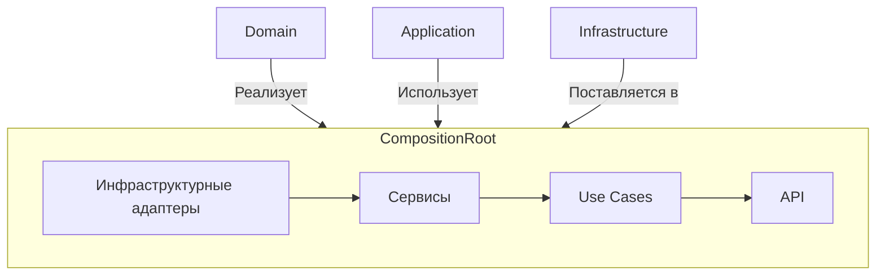

# Composition Root: сборка приложения

**Composition Root** — это единственное место в приложении, где происходит **сборка компонентов** и **инъекция зависимостей**. Здесь "оживают" абстракции: интерфейсы получают свои реализации, сервисы соединяются с адаптерами, и формируется готовое приложение.

> 🧩 Это не бизнес-логика, а **архитектурный каркас**, который связывает слои приложения.

---

## Основные задачи Composition Root

1. **Создание конкретных реализаций**  
   Например: `BitrixSender`, `SmtpSender`, `InfluxLogger`.

2. **Инъекция зависимостей**  
   Передача реализаций в use cases, сервисы и API-хендлеры через параметры.

3. **Настройка взаимодействия между слоями**  
   Например: подключение логгера к use case, выбор стратегии доставки.

4. **Изоляция от доменной логики**  
   В этом файле **нет бизнес-правил** — только конфигурация.

---

## Ключевые принципы

| Принцип                          | Объяснение                                                                                                         |
| -------------------------------- | ------------------------------------------------------------------------------------------------------------------ |
| ✅ **Единственное место сборки** | Все зависимости создаются только здесь. Нигде больше не должно быть `new BitrixSender()` или `createSmtpSender()`. |
| ✅ **Инверсия управления (IoC)** | Высокоуровневые модули (use cases) не зависят от низкоуровневых реализаций — они получают их через параметры.      |
| ✅ **Изоляция от домена**        | Composition Root не содержит логики вроде "если задача просрочена, то...". Он только связывает готовые кирпичики.  |
| ✅ **Тестируемость**             | Благодаря DI легко подменить зависимости при тестировании (например, `MockSender`).                                |

---

## Пример реализации

```ts
// composition/server/server.ts
export const getServerInstance = () => {
  // 1. Создаем инфраструктурные адаптеры
  const bitrixSender = createBitrixSender(config);
  const smtpSender = createSmtpSender(config);

  // 2. Настраиваем логгирование с fallback
  const logger = createFallbackLogger([
    createInfluxLogger(config),
    createFileLogger(),
    createConsoleLogger(),
  ]);

  // 3. Собираем отправщика с fallback-стратегией
  const sender = createFallbackSender([bitrixSender, smtpSender]);

  // 4. Создаем use case, внедряя зависимости
  const useCase = createSendNotificationUseCase({
    sender,
    logger,
  });

  // 5. Возвращаем готовый HTTP-сервер
  return createExpressServer(useCase);
};
```

> 💡 Этот код — **точка входа в приложение** (`src/index.ts` просто вызывает `createDefaultServer()`).

---

## Архитектурная схема



### Пояснение:

- **Domain** предоставляет интерфейсы (`NotificationSender`, `Logger`).
- **Infrastructure** предоставляет реализации (`BitrixSender`, `InfluxLogger`).
- **Application** — use cases (`SendNotificationUseCase`).
- **API** — Express-роуты.
- **Composition Root** — всё это соединяет.

---

## Преимущества такого подхода

- **Гибкость**: можно легко заменить стратегию или канал.
- **Тестируемость**: в тестах — `MockSender`, в проде — `BitrixSender`.
- **Читаемость**: вся "магия" DI в одном месте.
- **Поддерживаемость**: нет "размазанных" зависимостей по коду.

---

## Рекомендации

- ✅ Держите Composition Root **чистым и простым** — только сборка.
- ✅ Не добавляйте в него бизнес-логику.
- ✅ При росте проекта — разбейте на модули (например, `server.ts`, `worker.ts`).
- ✅ Используйте именованные синглтона: `getProductionServerInstance()`, `getTestServerInstance()`.
