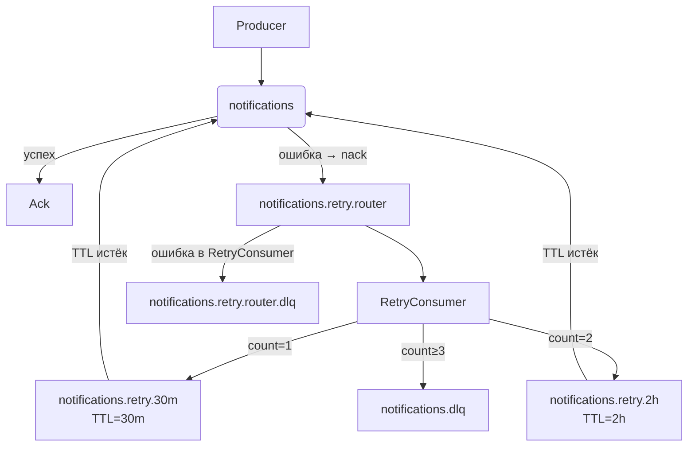

# 🐇 Очередь сообщений

Этот документ описывает, как сервис уведомлений использует **RabbitMQ** для надёжной, отказоустойчивой асинхронной обработки несрочных уведомлений с поддержкой **автоматических повторных попыток**.

---

## Обзор

Сервис:

- **Публикует** несрочные уведомления в очередь `notifications`.
- **Потребляет** их через `BatchConsumer` (обработка пачками).
- При ошибках — сообщение автоматически направляется в **`notifications.retry.router`**.
- **`RetryConsumer`** читает из этой очереди и маршрутизирует сообщение:
  - в `notifications.retry.30m` (задержка 30 минут),
  - в `notifications.retry.2h` (задержка 2 часа),
  - или в `notifications.dlq` (после 2 неудачных попыток).
- Очереди с TTL автоматически возвращают сообщения в `notifications` по истечении времени.

Это обеспечивает **гарантированную доставку** с экспоненциальной задержкой и защиту внешних систем от флуда.

> 💡 Каждое уведомление обрабатывается **максимум 3 раза**:  
> первая попытка → `retry.30m` → вторая → `retry.2h` → третья → `dlq`.

---

## Топология очередей

Система использует **6 очередей**, объявляемых при запуске миграции (`npm run migrate:prod`). Все — **durable**.

| Очередь                          | Назначение                                     |
| -------------------------------- | ---------------------------------------------- |
| `notifications`                  | Основная очередь для обработки                 |
| `notifications.retry.router`     | Промежуточная очередь для маршрутизации retry  |
| `notifications.retry.30m`        | Задержка 30 минут → возврат в `notifications`  |
| `notifications.retry.2h`         | Задержка 2 часа → возврат в `notifications`    |
| `notifications.dlq`              | Окончательная DLQ для проваленных уведомлений  |
| `notifications.retry.router.dlq` | DLQ для ошибок маршрутизации в `RetryConsumer` |

---

## Связи и маршрутизация

- `notifications` → при `nack` → `notifications.retry.router`  
  (`x-dead-letter-routing-key: notifications.retry.router`)
- `notifications.retry.30m` → по TTL → `notifications`  
  (`x-dead-letter-routing-key: notifications`)
- `notifications.retry.2h` → по TTL → `notifications`
- `notifications.retry.router` → при `nack` → `notifications.retry.router.dlq`
- `notifications.dlq` и `notifications.retry.router.dlq` — **без consumer’ов**, только для алертинга и анализа.

> ⚠️ **Две DLQ**:
>
> - `notifications.dlq` — бизнес-ошибки (канал недоступен, невалидные данные),
> - `notifications.retry.router.dlq` — инфраструктурные ошибки `notifications.retry.router` (сбой маршрутизации).

---

## Формат сообщения

Сообщение — JSON-сериализованный объект `Notification` с заголовками:

| Заголовок       | Тип      | Описание                   |
| --------------- | -------- | -------------------------- |
| `x-retry-count` | `number` | Номер попытки (0 — первая) |

---

## Поведение компонентов

### `BatchConsumer`

- Читает из `notifications`.
- При ошибке → `nack(false, false)` → сообщение уходит в `notifications.retry.router`.
- Успешные → `ack`.

### `RetryConsumer`

- Читает из `notifications.retry.router`.
- Увеличивает `x-retry-count`:
  - `1` → публикует в `notifications.retry.30m`,
  - `2` → в `notifications.retry.2h`,
  - `≥3` → в `notifications.dlq`.
- При ошибках маршрутизации → `nack` → сообщение попадает в `notifications.retry.router.dlq`.

### Очереди с TTL

- `notifications.retry.30m` и `notifications.retry.2h` — **не имеют consumer’ов**.
- Используют `x-message-ttl` + `x-dead-letter-*` для автоматического возврата в `notifications`.

---

## Диаграмма потока



---

## Миграции

Топология создаётся скриптом `setupRabbitMQ.ts`:

```bash
npm run migrate:prod
```

Скрипт:

- идемпотентен,
- объявляет все 6 очередей с правильными `x-dead-letter-*` и `x-message-ttl`,
- выполняет откат при ошибке.

---

## Мониторинг

- Все этапы логируются с `eventType`: `MessageConsume`, `HealthCheck`, `Bootstrap`.
- Обе DLQ подключены к алертингу.
- Сообщения несут `traceId`/`spanId` (если publisher/consumer интегрированы с OpenTelemetry).

---

## Перспективы

В будущем `RetryConsumer` может быть **вынесен в отдельный сервис**, чтобы:

- быть общим для нескольких микросервисов,
- масштабироваться независимо,
- упростить основной сервис уведомлений.

---

## Преимущества

✅ **Нет потерь**: все ошибки — в DLQ.  
✅ **Экспоненциальная задержка**: 30 м → 2 ч.  
✅ **Чёткое разделение**:  
 – `BatchConsumer` — бизнес-логика,  
 – `RetryConsumer` — инфраструктурная маршрутизация.  
✅ **Расширяемость**: легко добавить новые этапы retry.

```

```
