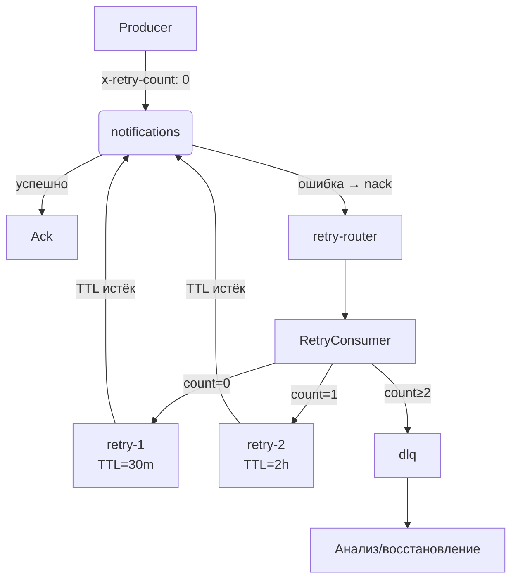

# 🐇 RabbitMQ: Асинхронная обработка уведомлений

Этот документ описывает, как сервис уведомлений использует **RabbitMQ** для надёжной, отказоустойчивой асинхронной обработки несрочных уведомлений с поддержкой **автоматических повторных попыток**.

## Обзор

Сервис:

- **Публикует** несрочные уведомления в очередь `notifications` с заголовком `"x-retry-count": 0`.
- **Потребляет** их через `BatchConsumer`, реализованный как **батч-обработчик**.
- При ошибках обработки — **отправляет сообщение в очередь `retry-router`**.
- Отдельный **`RetryConsumer`** читает из `retry-router`, увеличивает счётчик попыток и направляет сообщение:
  - в `retry-1` (задержка 30 минут),
  - в `retry-2` (задержка 2 часа),
  - или в `dlq` (после 2 неудачных попыток).

Это обеспечивает **гарантированную доставку** с экспоненциальной задержкой и предотвращает перегрузку внешних систем.

---

## Топология очередей

Система использует **пять очередей и один exchange по умолчанию**:

| Элемент         | Тип     | Назначение                                               |
| --------------- | ------- | -------------------------------------------------------- |
| `notifications` | очередь | Основная очередь для обработки уведомлений               |
| `retry-router`  | очередь | Промежуточная очередь для маршрутизации retry            |
| `retry-1`       | очередь | Задержка 30 минут → возврат в `notifications`            |
| `retry-2`       | очередь | Задержка 2 часа → возврат в `notifications`              |
| `dlq`           | очередь | Dead Letter Queue для окончательно проваленных сообщений |

> ⚙️ Все очереди объявляются при запуске миграции (`npm run migrate:prod`) и являются **durable**.

### Связи и маршрутизация

- **`notifications`** → при `nack(false, false)` → **`retry-router`**  
  (через DLX: `"x-dead-letter-routing-key": "retry-router"`)
- **`retry-router`** → читает **`RetryConsumer`**, который:
  - увеличивает `"x-retry-count"`,
  - публикует в `retry-1`, `retry-2` или `dlq` через **default exchange**.
- **`retry-1`** → после TTL (30 мин) → **`notifications`**  
  (через DLX: `"x-dead-letter-routing-key": "notifications"`)
- **`retry-2`** → после TTL (2 ч) → **`notifications`**
- **`dlq`** → финальная очередь, без автоматической обработки.

> 💡 Каждое сообщение может быть обработано **максимум 3 раза**:  
> попытка 0 → retry-1 → попытка 1 → retry-2 → попытка 2 → dlq.

---

## Формат сообщения

Каждое сообщение — это JSON-сериализованная структура `Notification`.  
Кроме того, используются **заголовки (headers)** для управления retry:

| Заголовок                  | Тип       | Описание                                                    |
| -------------------------- | --------- | ----------------------------------------------------------- |
| `x-retry-count`            | `number`  | Текущий номер попытки (0 — первая отправка)                 |
| `x-unexpected-retry-count` | `number`  | Диагностический заголовок при неожиданном значении счётчика |
| `x-retry-consumer-failure` | `boolean` | Указывает на ошибку в `RetryConsumer`                       |

Пример сообщения:

```json
{
  "id": "notif-123",
  "contacts": [{ "type": "email", "value": "user@example.com" }],
  "message": "Ваш заказ обработан",
  "isImmediate": false
}
```

---

## Поведение компонентов

### 1. `BatchConsumer` (основной)

- Читает из **`notifications`**.
- При ошибке обработки → вызывает `nack(false, false)`.
- **Не управляет retry** — делегирует это инфраструктуре RabbitMQ.
- Подтверждает только успешные сообщения (`ack`).

### 2. `RetryConsumer` (специализированный)

- Читает из **`retry-router`**.
- **Не принимает внешнюю логику** — его задача — только маршрутизация.
- Увеличивает `x-retry-count` и отправляет сообщение:
  - `count=0` → `retry-1`
  - `count=1` → `retry-2`
  - `count≥2` → `dlq`
- При ошибках маршрутизации — отправляет в `dlq` с диагностическими заголовками.

### 3. Очереди `retry-1` / `retry-2`

- **Не имеют consumer’ов**.
- Используют **TTL + DLX** для автоматического возврата в `notifications`.

---

## Диаграмма потока сообщения



---

## Миграции

Топология создаётся скриптом `setupRabbitMQ.ts`:

```bash
npm run migrate:dev    # development
npm run migrate:prod   # production
```

Скрипт идемпотентен и объявляет все 5 очередей с правильными аргументами:

- `x-message-ttl` для `retry-1` и `retry-2`,
- `x-dead-letter-*` для всех очередей.

---

## Мониторинг и observability

- Все этапы логируются с соответствующими `eventType`:
  - `Bootstrap`, `Shutdown` — запуск/остановка consumer’ов,
  - `MessageConsume` — обработка батчей,
  - `HealthCheck` — проверка доступности RabbitMQ.
- **DLQ подключена к алертингу** (Telegram).
- Сообщения несут `traceId`/`spanId` через OpenTelemetry (если интегрировано на уровне publisher/consumer).

---

## Перспективы развития

В текущей реализации `RetryConsumer` запускается как часть основного сервиса уведомлений. Однако в будущем его можно **вынести в отдельный микросервис**, который будет:

- **Общим для нескольких сервисов**, использующих аналогичную схему retry с RabbitMQ.
- **Масштабироваться независимо**, учитывая нагрузку на маршрутизацию.
- **Упрощать развёртывание** основных сервисов — им больше не нужно управлять retry-инфраструктурой.
- **Обеспечивать централизованную observability** и обработку ошибок маршрутизации.

Такой подход усилит принцип **разделения ответственности**: бизнес-сервисы фокусируются на своей логике, а retry-механика становится частью инфраструктурного слоя.

---

## Преимущества новой архитектуры

✅ **Нет потерь сообщений** — все ошибки обрабатываются.  
✅ **Экспоненциальная задержка** — защита от флуда внешних систем.  
✅ **Чёткое разделение ответственности**:

- `BatchConsumer` — только бизнес-логика,
- `RetryConsumer` — только инфраструктурная маршрутизация.  
  ✅ **Лёгкое расширение** — можно добавить `retry-3`, изменить TTL и т.п. без правок в основном коде.
