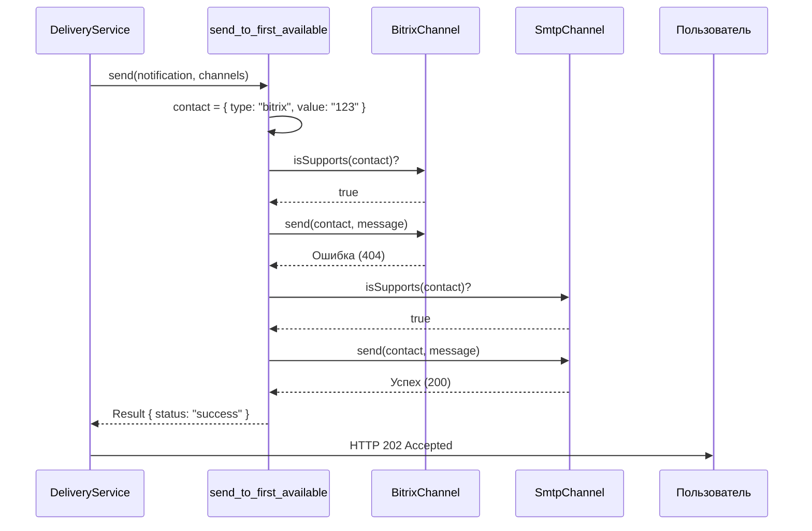
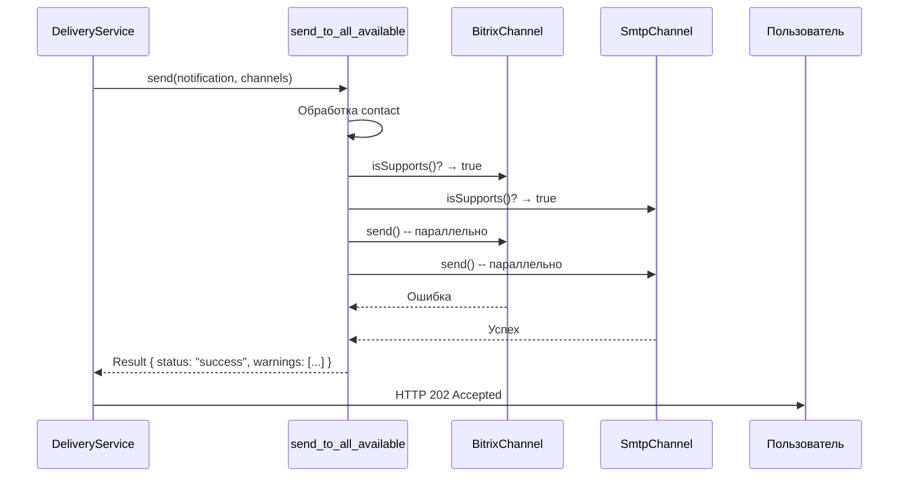

# 📦 Стратегии доставки уведомлений

Этот документ описывает **доступные стратегии доставки уведомлений** в сервисе `notification-service`.  
Стратегии определяют **логику отправки сообщений** через доступные каналы (например, `email`, `bitrix`), позволяя гибко настраивать поведение системы без изменения её ядра.

---

## 🧩 Общая концепция

Сервис поддерживает **динамический выбор стратегии доставки на уровне каждого уведомления**.  
Клиент указывает желаемую стратегию через поле `notification.strategy`, например:

```json
{
  "contacts": [{ "type": "email", "value": "user@example.com" }],
  "message": "Привет!",
  "strategy": "send_to_all_available"
}
```

Если поле не задано — используется стратегия по умолчанию: **`send_to_first_available`**.

Стратегии реализованы как функции, соответствующие контракту:

```ts
type DeliveryStrategy = (
  notification: Notification,
  channels: Channel[],
) => Promise<Result>;
```

Где:

- `notification` — уведомление с получателями, сообщением и метаданными,
- `channels` — список доступных каналов доставки,
- `Result` — объект с полем `status: "success" | "failure"` и, при необходимости, `error` или `warnings`.

> ✅ **Стратегии никогда не выбрасывают исключения** — они всегда возвращают `Result`, что позволяет:
>
> - обрабатывать ошибки централизованно,
> - сохранять информацию о частичных сбоях (`warnings`),
> - поддерживать устойчивость к сбоям отдельных каналов.

Выбор конкретной стратегии выполняется **внутри `DeliveryService`** на основе значения поля `notification.strategy`.  
Стратегии определены как **enum**:

---

## 1. `send_to_first_available`

### 🎯 Назначение

Отправить уведомление **первому получателю, которому удалось доставить сообщение**, и завершить процесс.

> Аналог: «fallback-цепочка» — попробовать Bitrix → при ошибке → попробовать Email → при успехе — остановиться.

---

### 🔍 Как работает

1. Для каждого контакта в `notification.contacts`:
   - Фильтруются каналы, поддерживающие его тип (`channel.isSupports(contact)`),
   - Каналы перебираются **последовательно**,
   - При **первом успехе** — отправка для этого контакта завершается.
2. Уведомление считается **успешным**, если **хотя бы один контакт** был доставлен.

> ⚠️ Отправка **прекращается после первого успешного канала**.

---

### 📈 Диаграмма последовательности



---

### ✅ Когда использовать

- **Приоритет на основной канал** (например, Bitrix24), резервный — Email,
- Нужно **минимизировать количество отправок**,
- Уведомление достаточно доставить **хотя бы одним способом**,
- Типичные сценарии:
  - Уведомление о просроченной задаче,
  - Смена статуса задачи,
  - Назначение ответственного.

---

## 2. `send_to_all_available`

### 🎯 Назначение

Отправить уведомление **всем получателям по всем подходящим каналам** параллельно.  
Уведомление считается доставленным, если **хотя бы один канал** успешно отправил.

> Аналог: «broadcast» — отправить всем, кто может получить.

---

### 🔍 Как работает

1. Для каждого контакта:
   - Определяются все каналы, поддерживающие его тип,
   - Отправка запускается **параллельно** через все подходящие каналы (`Promise.allSettled`),
2. Все результаты агрегируются,
3. Уведомление считается **успешным**, если **хотя бы одна попытка** завершилась успехом.

> ⚠️ Отправка **не прерывается** после первого успеха — пытаемся отправить всем.

---

### 📈 Диаграмма последовательности



---

### ✅ Когда использовать

- Нужно **максимально повысить вероятность получения** уведомления,
- Важные события, где **дублирование допустимо**,
- Уведомления для **администраторов или ответственных лиц**,
- Примеры:
  - Критическое падение системы,
  - Создание нового проекта с участием нескольких команд,
  - Уведомление о смене владельца задачи.

---

## 🧰 Как создать свою стратегию

Новые стратегии добавляются путём реализации функции, соответствующей контракту `DeliveryStrategy`, и **расширения внутреннего `switch` в `DeliveryService`**.

---

## 🧩 Возможные стратегии (идеи для будущего)

| Стратегия          | Описание                                                    |
| ------------------ | ----------------------------------------------------------- |
| `priority_based`   | Отправка по приоритету каналов (Telegram > Email > SMS)     |
| `broadcast_to_all` | Отправить всем, даже если дублируется                       |
| `conditional`      | Выбор стратегии по условию (ночное время → только Telegram) |
| `delayed`          | Отложить отправку на N минут                                |
| `sampling`         | Отправлять только части пользователей (для A/B тестов)      |

---

## 📌 Выводы

| Стратегия                 | Когда использовать        | Отправляет        | Дублирование |
| ------------------------- | ------------------------- | ----------------- | ------------ |
| `send_to_first_available` | Основной канал + fallback | Первому успешному | Нет          |
| `send_to_all_available`   | Максимальная доставка     | Всем подходящим   | Да           |

- Стратегия **выбирается для каждого уведомления отдельно** через поле `strategy`.
- Все стратегии возвращают **`Result` с `status`**, а не выбрасывают ошибки.
- Новые стратегии требуют **модификации `DeliveryService`**, но **не нарушают чистую архитектуру**.

> 💡 **Совет**:  
> Используйте `send_to_first_available` для повседневных уведомлений (статусы, назначения).  
> Включайте `send_to_all_available` только для критически важных событий (аварии, смена владельца).

```

```
