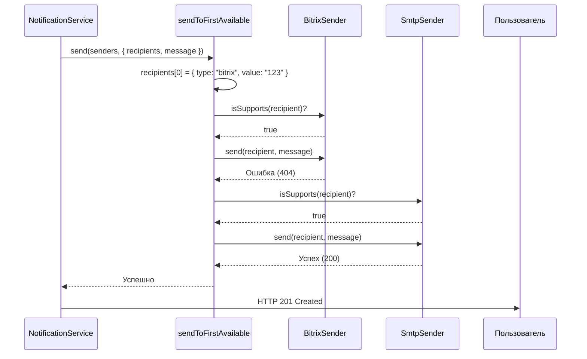
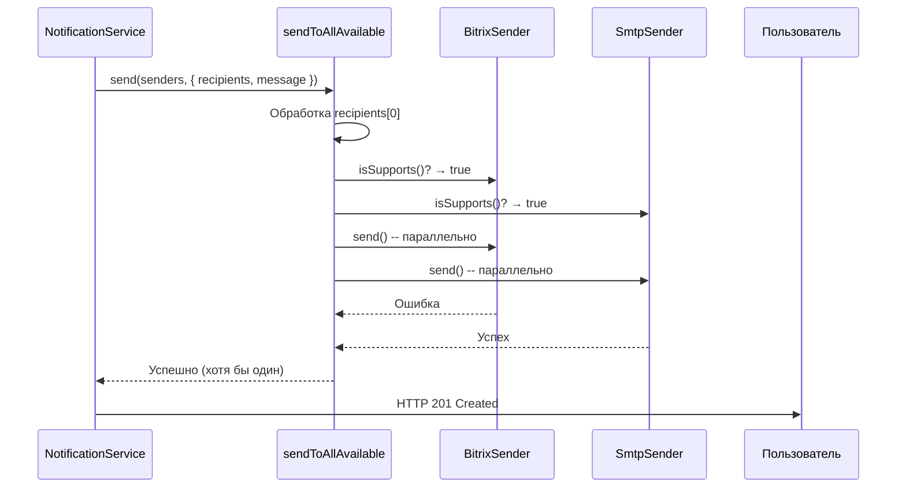

# 📦 Стратегии доставки уведомлений

Этот документ описывает **доступные стратегии доставки уведомлений** в сервисе `notification-service`.  
Стратегии определяют **логику отправки сообщений** через доступные каналы (например, Bitrix24, Email), позволяя гибко настраивать поведение системы без изменения её ядра.

Стратегии реализуют интерфейс `DeliveryStrategy` и могут быть легко заменены или расширены.

---

## 🧩 Общая концепция

Сервис поддерживает **динамический выбор стратегии доставки на уровне каждого уведомления**.  
Клиент указывает желаемую стратегию через поле `notification.strategy`, например:

```json
{
  "recipients": [{ "type": "email", "value": "user@example.com" }],
  "message": "Привет!",
  "strategy": "send_to_all_available"
}
```

Если поле не задано — используется стратегия по умолчанию: `send_to_first_available`.

Все стратегии реализуют единый контракт:

```ts
type DeliveryStrategy = (
  notification: Notification,
  senders: Sender[],
) => Promise<SendResult>;
```

Где:

- `notification` — уведомление с получателями, сообщением и метаданными,
- `senders` — список доступных каналов доставки,
- `SendResult` — структурированный результат с флагом успеха, деталями и предупреждениями.

Стратегии **не выбрасывают исключения**, а всегда возвращают `SendResult`, что позволяет:

- обрабатывать ошибки централизованно,
- сохранять информацию о частичных ошибках (`warnings`),
- поддерживать устойчивость к сбоям отдельных каналов.

Выбор конкретной стратегии происходит через **реестр** (`strategyRegistry`), что делает систему легко расширяемой: для добавления новой стратегии достаточно реализовать функцию и зарегистрировать её по уникальному ключу.

---

## 1. `sendToFirstAvailableStrategy`

### 🎯 Назначение

Отправить уведомление **первому получателю, которому удалось доставить сообщение**, и завершить процесс.

> Аналог: "fallback-цепочка" — попробовать Bitrix → если не получилось, попробовать Email → если и это не сработало — ошибка.

---

### 🔍 Как работает

1. Для каждого получателя:
   - Фильтруем каналы, которые поддерживают его тип (`isSupports(recipient)`)
   - Пытаемся отправить через каждый канал **по очереди**
   - При **успехе** — завершаем стратегию (уведомление считается доставленным)
2. Если **ни одному** получателю не удалось доставить — выбрасываем ошибку

> ⚠️ Отправка **прекращается после первого успешного канала**.

---

### 📈 Диаграмма последовательности



---

### ✅ Когда использовать

- **Приоритет на основной канал** (например, Bitrix24), резервный — Email
- Нужно **минимизировать количество отправок**
- Уведомление достаточно доставить **хотя бы одним способом**
- Типичные сценарии:
  - Уведомление о просроченной задаче
  - Смена статуса задачи
  - Назначение ответственного

---

### 🧪 Пример использования

```ts
const service = createNotificationDeliveryService(
  [bitrixSender, smtpSender],
  sendToFirstAvailableStrategy,
);

await service.send({
  recipients: [
    { type: "bitrix", value: "12345" },
    { type: "email", value: "user@company.com" },
  ],
  message: "Ваша задача просрочена",
});
```

> Результат: попытка через Bitrix → при ошибке → попытка через Email → при успехе — отправка завершена.

---

## 2. `sendToAllAvailableStrategy`

### 🎯 Назначение

Отправить уведомление **всем получателям по всем подходящим каналам** параллельно.  
Уведомление считается доставленным, если **хотя бы один канал** успешно отправил.

> Аналог: "broadcast" — отправить всем, кто может получить.

---

### 🔍 Как работает

1. Для каждого получателя:
   - Определяем все каналы, которые его поддерживают
   - Запускаем отправку **параллельно** через все подходящие каналы
2. Ждём завершения всех попыток
3. Если **все попытки провалились** — выбрасываем ошибку

> ⚠️ Отправка **не прерывается** после первого успеха — пытаемся отправить всем.

---

### 📈 Диаграмма последовательности



---

### ✅ Когда использовать

- Нужно **максимально повысить вероятность получения** уведомления
- Важные события, где **дублирование допустимо**
- Уведомления для **администраторов или ответственных лиц**
- Примеры:
  - Критическое падение системы
  - Создание нового проекта с участием нескольких команд
  - Уведомление о смене владельца задачи

---

### 🧪 Пример использования

```ts
const service = createNotificationDeliveryService(
  [bitrixSender, smtpSender],
  sendToAllAvailableStrategy,
);

await service.send({
  recipients: [{ type: "bitrix", value: "12345" }],
  message: "Система перешла в режим обслуживания",
});
```

> Результат: попытка отправки через Bitrix **и** через Email (если оба поддерживают тип), даже если один уже сработал.

---

## 🧰 Как создать свою стратегию

Ты можешь легко добавить новую стратегию, реализовав интерфейс `DeliveryStrategy`.

### Пример: `sendWithRetryStrategy`

```ts
import { DeliveryStrategy } from "./types/DeliveryStrategy.js";

const withRetry = async <T>(
  fn: () => Promise<T>,
  retries: number,
): Promise<T> => {
  let lastError;
  for (let i = 0; i < retries; i++) {
    try {
      return await fn();
    } catch (error) {
      lastError = error;
    }
  }
  throw lastError;
};

export const sendWithRetryStrategy: DeliveryStrategy = async (
  senders,
  { recipients, message },
  onError,
) => {
  for (const recipient of recipients) {
    const supported = senders.filter((s) => s.isSupports(recipient));
    await withRetry(
      () => sendToRecipient(recipient, message, supported, onError),
      3,
    );
  }
};
```

> Такую стратегию можно комбинировать с другими паттернами (retry, circuit breaker и т.д.).

---

## 🧩 Возможные стратегии (идеи для будущего)

| Стратегия                | Описание                                                          |
| ------------------------ | ----------------------------------------------------------------- |
| `priorityBasedStrategy`  | Отправка по приоритету каналов (например, Telegram > Email > SMS) |
| `broadcastToAllStrategy` | Отправить всем, даже если дублируется                             |
| `conditionalStrategy`    | Выбор стратегии по условию (время суток, тип уведомления)         |
| `delayedStrategy`        | Отложить отправку на N минут                                      |
| `samplingStrategy`       | Отправлять только части пользователей (для A/B тестов)            |

---

## 📌 Выводы

| Стратегия                      | Когда использовать        | Отправляет        |
| ------------------------------ | ------------------------- | ----------------- |
| `sendToFirstAvailableStrategy` | Основной канал + fallback | Первому успешному |
| `sendToAllAvailableStrategy`   | Максимальная доставка     | Всем подходящим   |

- Стратегия **выбирается для каждого уведомления отдельно** через поле `strategy`.
- Новые стратегии легко добавляются через **реестр**, без изменения ядра сервиса.
- Все стратегии возвращают **структурированный результат** (`SendResult`), включая предупреждения и ошибки.

> 💡 Совет: используй `send_to_first_available` для повседневных уведомлений и `send_to_all_available` — для критически важных событий.
