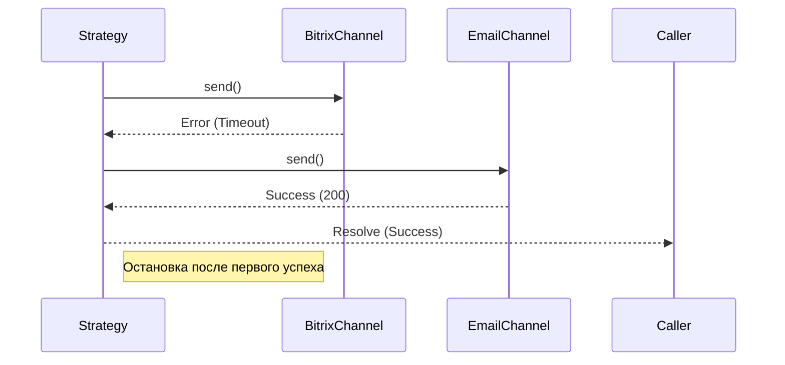
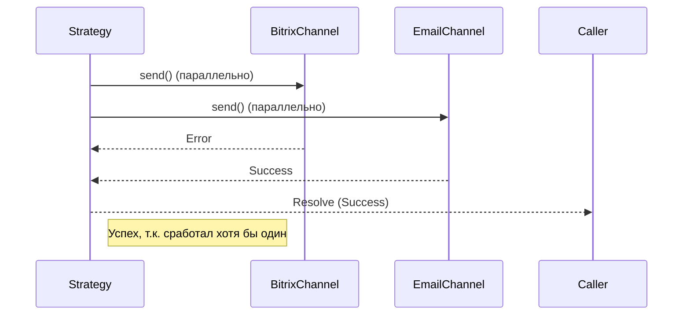
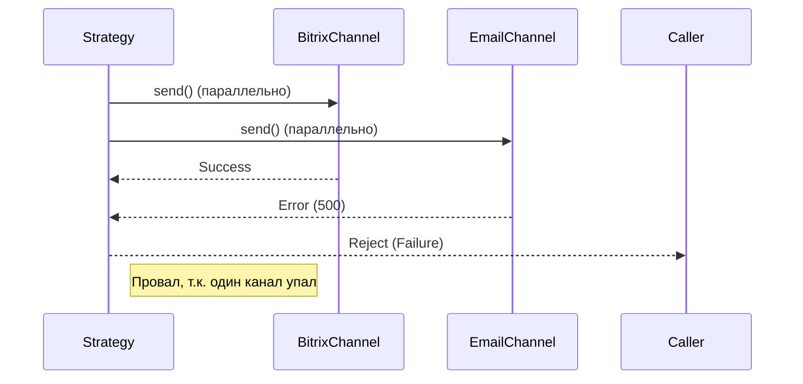

# 📦 Стратегии доставки уведомлений

Этот документ описывает **доступные стратегии доставки**.  
Стратегии определяют алгоритм обработки массива контактов получателя, позволяя гибко управлять надежностью доставки и потреблением ресурсов без изменения кода ядра.

---

## 🧩 Общая концепция

Сервис поддерживает **динамический выбор стратегии** на уровне каждого уведомления через поле `strategy`.

```json
{
  "contacts": [
    { "type": "email", "value": "user@example.com" },
    { "type": "bitrix", "value": 12345 }
  ],
  "message": "Важное уведомление",
  "strategy": "send_to_all_available"
}
```

Если поле не указано, используется стратегия по умолчанию: **`send_to_first_available`**.

### Контракт стратегии

Все стратегии реализованы как чистые функции, соответствующие интерфейсу:

```ts
type Strategy = (
  notification: Notification,
  channels: readonly Channel[],
) => Promise<void>;
```

- **Вход:** Уведомление со списком контактов и набор доступных адаптеров каналов.
- **Выход:** `Promise<void>`.
  - Если стратегия выполнена успешно — промис резолвится.
  - Если критерий стратегии не выполнен — промис реджектится с ошибкой.

> ✅ **Принцип устойчивости:** Стратегии инкапсулируют логику обработки ошибок каналов. Они решают, является ли ошибка отдельного канала критической для всего уведомления или её можно игнорировать.

---

## 1. `send_to_first_available`

### 🎯 Назначение

**Экономия ресурсов.** Отправить уведомление первым успешным способом и немедленно остановиться.

> **Логика:** «Попробуй каналы по очереди. Как только один сработал — задача выполнена».

### 🔍 Алгоритм

1. Перебирает контакты и поддерживающие их каналы **последовательно**.
2. Выполняет отправку в первый подходящий канал.
3. При **успехе** — немедленно завершает работу (остальные каналы игнорируются).
4. При **ошибке** — переходит к следующему каналу.
5. Если все каналы вернули ошибку — стратегия выбрасывает исключение.

### 📈 Диаграмма последовательности


```mermaid
sequenceDiagram
    participant S as Strategy
    participant C1 as BitrixChannel
    participant C2 as EmailChannel

    S->>C1: send()
    C1-->>S: Error (Timeout)

    S->>C2: send()
    C2-->>S: Success (200)

    S-->>Caller: Resolve (Success)
    Note right of S: Остановка после первого успеха
```

### ✅ Когда использовать

- Повседневные уведомления (статусы задач, комментарии).
- Когда достаточно доставить сообщение **любым одним способом**.
- Для экономии лимитов внешних API и снижения нагрузки.

---

## 2. `send_to_any_available`

### 🎯 Назначение

**Максимальная вероятность доставки.** Попытаться отправить во все каналы, но считать операцию успешной, если сработал **хотя бы один**.

> **Логика:** «Попробуй везде. Если хоть куда-то дошло — отлично. Ошибки отдельных каналов не критичны».

### 🔍 Алгоритм

1. Запускает отправку во все подходящие каналы **параллельно**.
2. Собирает результаты всех попыток.
3. Если **хотя бы один** канал вернул успех — стратегия завершается успешно (`Resolve`).
4. Если **все** каналы вернули ошибку — стратегия выбрасывает исключение (`Reject`).
5. Частичные ошибки (например, Bitrix упал, а Email ушел) **игнорируются**.

### 📈 Диаграмма последовательности


```mermaid
sequenceDiagram
    participant S as Strategy
    participant C1 as BitrixChannel
    participant C2 as EmailChannel

    S->>C1: send() (параллельно)
    S->>C2: send() (параллельно)

    C1-->>S: Error
    C2-->>S: Success

    S-->>Caller: Resolve (Success)
    Note right of S: Успех, т.к. сработал хотя бы один
```

### ✅ Когда использовать

- Важные уведомления, где критично, чтобы пользователь получил их **любым путем**.
- Ситуации с нестабильными каналами связи (страховка от временных сбоев SMTP или API Bitrix).
- Алерты для ответственных лиц.

---

## 3. `send_to_all_available`

### 🎯 Назначение

**Строгая гарантия доставки (Strict Consistency).** Требует успешной отправки **во все** указанные каналы.

> **Логика:** «Или всем, или никому. Если хоть один канал упал — всё уведомление считается неудачным».

### 🔍 Алгоритм

1. Запускает отправку во все подходящие каналы.
2. Собирает результаты всех попыток.
3. Если **все** каналы вернули успех — стратегия завершается успешно (`Resolve`).
4. Если **хотя бы один** канал вернул ошибку — стратегия **немедленно считает операцию проваленной** и выбрасывает исключение (`Reject`).

> ⚠️ Эта стратегия наименее устойчива к сбоям отдельных провайдеров, но гарантирует, что пользователь получит сообщение во всех запланированных каналах.

### 📈 Диаграмма последовательности


```mermaid
sequenceDiagram
    participant S as Strategy
    participant C1 as BitrixChannel
    participant C2 as EmailChannel

    S->>C1: send() (параллельно)
    S->>C2: send() (параллельно)

    C1-->>S: Success
    C2-->>S: Error (500)

    S-->>Caller: Reject (Failure)
    Note right of S: Провал, т.к. один канал упал
```

### ✅ Когда использовать

- Юридически значимые уведомления (требуется подтверждение получения всеми способами).
- Синхронизация статусов, где важно состояние во всех системах одновременно.
- Сценарии, где частичная доставка может ввести пользователя в заблуждение.

---

## 🧰 Расширение системы

Добавление новой стратегии не требует изменения ядра сервиса.

1. Реализуйте функцию, соответствующую типу `Strategy`.
2. Зарегистрируйте её в DI-контейнере или реестре стратегий.
3. Добавьте новое значение в enum `StrategyType`.

---

## 📌 Сравнительная таблица

| Характеристика               | `send_to_first_available` | `send_to_any_available`      | `send_to_all_available`      |
| :--------------------------- | :------------------------ | :--------------------------- | :--------------------------- |
| **Критерий успеха**          | Первый успешный канал     | Хотя бы один успешный        | **Все** каналы успешны       |
| **Реакция на ошибку канала** | Игнорирует, идет дальше   | Игнорирует (если есть успех) | **Проваливает всю операцию** |
| **Нагрузка на каналы**       | Минимальная               | Средняя/Высокая              | Высокая                      |
| **Гарантия доставки**        | Базовая                   | Высокая (Resilient)          | Строгая (Consistent)         |
| **Сценарий**                 | Обычные уведомления       | Важные алерты                | Критичные/Юридические данные |

> 💡 **Рекомендация:**  
> Используйте `send_to_first_available` для 90% задач.  
> Подключайте `send_to_any_available` для важных событий.  
> `send_to_all_available` используйте только там, где бизнес-логика требует строгой консистентности по всем каналам.
